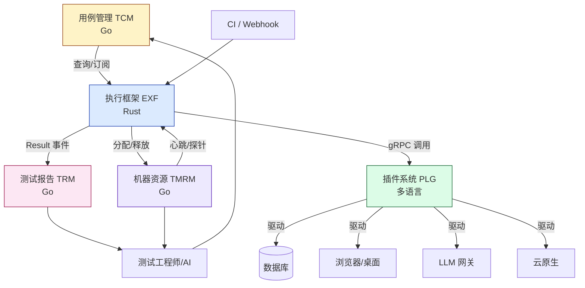
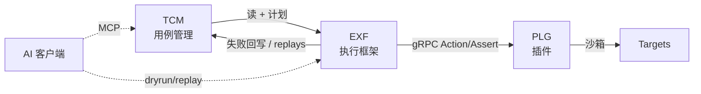
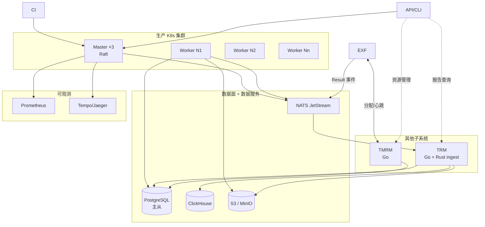

# 架构设计文档（总览）

> 版本：v3.0（彻底拆分）  
> 本文档是 **整体架构总览**，专注于**跨模块边界、语言分层、关键协议、部署形态**。  
> 各模块的详细设计请阅读对应的分模块设计文档。

## 分模块设计文档

| 模块 | 文档 | 关注点 |
| --- | --- | --- |
| 用例管理（TCM） | [`test-case-management-design.md`](test-case-management-design.md) | 数据模型、存储、索引、版本、权限、AI 协作 |
| 执行框架（EXF） | [`execution-framework-design.md`](execution-framework-design.md) | 调度、并发模型、高性能、状态机、分布式、Rust/Go 演进 |
| 插件系统（PLG） | [`plugin-system-design.md`](plugin-system-design.md) | 插件协议、Manifest、gRPC、Sandbox、SDK |
| 测试报告管理（TRM） | [`test-report-management-design.md`](test-report-management-design.md) | 结果接入、冷热分层、查询、对比、Flaky、告警、导出 |
| 测试机器资源管理（TMRM） | [`test-machine-resource-management-design.md`](test-machine-resource-management-design.md) | 机器注册、分配、扩缩容、Quota、计费、健康 |

## 1. 顶层架构图




```text
┌─────────────────────────────────────────────────────────────┐
│  Test Case Management（用例管理）                            │
│  Storage / Index / Versioning / RBAC / API / MCP             │
└──────────────┬───────────────────────┬──────────────────────┘
               │  Query / Diff / Export│  Read & Write
               ▼                       ▼
┌───────────────────────┐  ┌──────────────────────┐
│ Plan & Trigger        │  │ Reporting / Replay   │
└──────────┬────────────┘  └──────────┬───────────┘
           ▼                           ▲
┌─────────────────────────────────────────────────────────────┐
│  Execution Framework（执行框架）                              │
│  Master (Plan→DAG→Task) ─▶ Broker ─▶ Worker Pool            │
│  State Machine / Replayer / Result-Store                     │
└──────────┬──────────────────────────────────────────────────┘
           │  gRPC (Protobuf) ─ 极简协议
           ▼
┌─────────────────────────────────────────────────────────────┐
│  Plugin System（插件系统）                                    │
│  Plugin A (DB)   Plugin B (Web)   Plugin C (LLM)  ...        │
│  ┌────────────┐ ┌────────────┐ ┌────────────┐               │
│  │  Sandbox   │ │  Sandbox   │ │  Sandbox   │               │
│  └────────────┘ └────────────┘ └────────────┘               │
└──────────┬──────────────────────────────────────────────────┘
           ▼
      Targets / 被测对象
```

## 2. 三模块边界




| 边界 | 接口 / 协议 | 备注 |
| --- | --- | --- |
| TCM → EXF | `GET /v1/cases?expr=...` `GET /v1/cases/{id}@{ver}` `POST /v1/plans` | 只读 + 计划创建；执行结果回写结果库 |
| EXF → TRM | NATS `result.events` / gRPC `Result` 流 | TRM 负责聚合、查询、Flaky、告警 |
| EXF → TMRM | gRPC `Allocate / Release / Heartbeat` | EXF 拉取机器、回报心跳 |
| TMRM → PLG | 机器元数据 + 凭据 | 通过 target endpoint 注入 |
| TRM → TCM | `case.tags` 回写 | Flaky 标记回写（需 RBAC） |
| EXF → PLG | gRPC `Plugin` 服务（Manifest / Action / Assert） | 内核不解释业务字段 |
| EXF → OBS | OTLP + Prometheus | 由 EXF 主导 |
| TCM → AIC | MCP Server / OpenAPI | LLM 客户端访问 |
| EXF ← AIC | `aitest-dryrun / replays` | AI 协作的护栏 |
| EXF → TCM | 失败用例回写 `replay_of` | 触发自动入库 |

## 3. 语言分层（关键约束）

```text
┌─────────────────────────────────────────┐
│ Python 层（原型 / 插件 SDK / 工具链）      │
│  - aitest CLI / dryrun / lint / MCP     │
│  - plugin SDK (Python)                  │
└─────────────────────────────────────────┘
            ▲ 协议（HTTP/gRPC）
            │
┌─────────────────────────────────────────┐
│ 候选生产层：Rust 或 Go                    │
│  - TCM 服务 (推荐 Go：生态成熟)            │
│  - EXF 内核 (推荐 Rust：极致并发/无 GC)    │
│  - 同一进程不混用；FFI 走 cgo / Rust ABI  │
└─────────────────────────────────────────┘
            ▲ 协议（HTTP/gRPC）
            │
┌─────────────────────────────────────────┐
│ 任意语言插件（Go / Rust / Python / Java）│
│  通过 gRPC + Manifest 接入                │
└─────────────────────────────────────────┘
```

| 模块 | 候选语言 | 选型理由 |
| --- | --- | --- |
| 用例管理 (TCM) | **Go** | HTTP / SQL 生态成熟；CRUD + 索引场景不需要极低延迟；招人容易 |
| 执行框架 (EXF) | **Rust** | 调度热路径要无 GC、零拷贝、单机万级协程；Tokio/async-std 提供高并发原语 |
| 插件系统 (PLG) | **多语言** | 协议是 gRPC/Protobuf，任意语言实现；提供 Go/Rust/Python/Java SDK |
| 测试报告管理 (TRM) | **Go**（接入 Rust） | 摄取侧 Rust（高吞吐），查询 / API / Flaky / 告警 Go |
| 测试机器资源 (TMRM) | **Go** | 状态机 + 云 SDK 生态成熟；eBPF 健康探针可用 Go bindings |
| CLI / 工具链 | **Python** | 用户粘性高；试错成本低；与 LLM 生态一致 |
| 性能插件 (Web/DB) | **Rust/Go** | 复用 tokio/数据库驱动，性能更好 |

**关键约束**：

1. **执行内核不得依赖 Python**。任何 Python 能力必须通过 `plugin-sdk` 外置为进程外插件。
2. 任意模块只能依赖 **协议层**（HTTP / gRPC / Protobuf），不得共享进程内对象或数据库连接。
3. 内核与 SDK 必须以 **版本化接口** 通信；接口变化必须遵循 SemVer。

## 4. 性能目标（与 NFR 对齐）

| 指标 | 目标 | 设计抓手 |
| --- | --- | --- |
| 调度延迟 P95 | ≤ 50 ms | 无锁队列 + 单调度协程 + 批量出队 |
| 分发延迟 P95 | ≤ 200 ms | 长连接 + ZeroMQ/gRPC Stream + 预取 |
| Worker 拉取 P95 | ≤ 50 ms | 内存优先队列 + 推送回压 |
| 单集群并发 | ≥ 10K | tokio 多核调度 + cgroup 隔离 |
| 待执行队列 | ≥ 100K | 分片 + 冷热分层 |
| 吞吐 | ≥ 10K 用例/分钟 | 批处理 + 协程池 + 零拷贝序列化 |
| 可用性 | 99.9% | Master 3 节点 + Worker 弹性 + 任务幂等 |
| 状态机一致性 | 强一致 | Result-Store 用 PG 强一致 + Worker 心跳 |

## 5. 关键协议（指向分模块文档）

| 协议 | 定义位置 | 用途 |
| --- | --- | --- |
| `Case` JSON Schema | TCM 设计文档 §3 | 用例数据契约 |
| `Plan` gRPC | EXF 设计文档 §协议 | 执行计划下发 |
| `Plugin` gRPC | 插件系统设计文档 §协议 | 插件能力调用 |
| `Result` Protobuf | EXF 设计文档 §协议 | 结果上报 |
| `Broker` Queue | EXF 设计文档 §协议 | 任务总线 |

## 6. 部署形态




| 形态 | 适用 | 组件 |
| --- | --- | --- |
| All-in-one | 本地 / CI | 单进程 |
| 单机多进程 | 中小团队 | API + Worker + PG + MinIO |
| 分布式集群 | 生产 | Master(3) + Worker(N) + PG + NATS + S3 + Prometheus + Tempo |

## 7. 演进路线

| 阶段 | 目标 | 关键能力 |
| --- | --- | --- |
| v0.1 (当前 aitest) | Python 原型 | 单进程、内核 + 6 命令 + 8 断言 |
| v0.5 | 单机生产可用 | Python 内核 + 队列 + 沙箱 + 2 类插件 |
| v1.0 | 分布式 + 多语言 | EXF 改 Rust；TCM 改 Go；10K 并发；10 类插件 |
| v2.0 | AI 闭环 | 生成 / 自愈 / 语义检索 / Replayer |
| v3.0 | 自治测试 | 探索式 / 失败预测 / 智能调度 |

## 8. 跨模块 SLA 矩阵

| 调用 | P95 | P99 | 失败处理 |
| --- | --- | --- | --- |
| TCM 读 | 50 ms | 200 ms | 读副本 fallback |
| TCM 写 | 200 ms | 1 s | 写重试 / 死信 |
| EXF 调度 | 50 ms | 200 ms | 调度降级（本地队列接管） |
| EXF 拉取 | 50 ms | 200 ms | 重试 + 切换 broker |
| Plugin Action | 自定义 | 自定义 | 超时即失败，按策略重试 |
| Result 上报 | 100 ms | 500 ms | 落本地 + 异步 flush |

---

> 详细设计请阅读三个分模块设计文档：
> - [用例管理设计](test-case-management-design.md)
> - [执行框架设计](execution-framework-design.md)
> - [插件系统设计](plugin-system-design.md)
