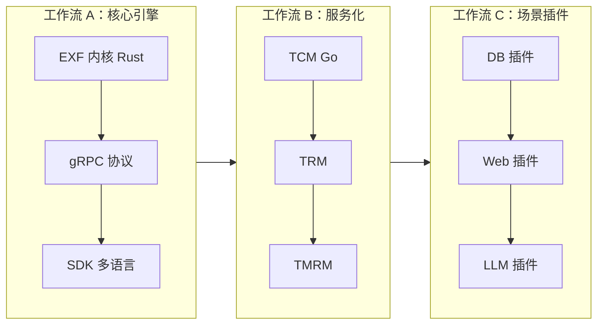
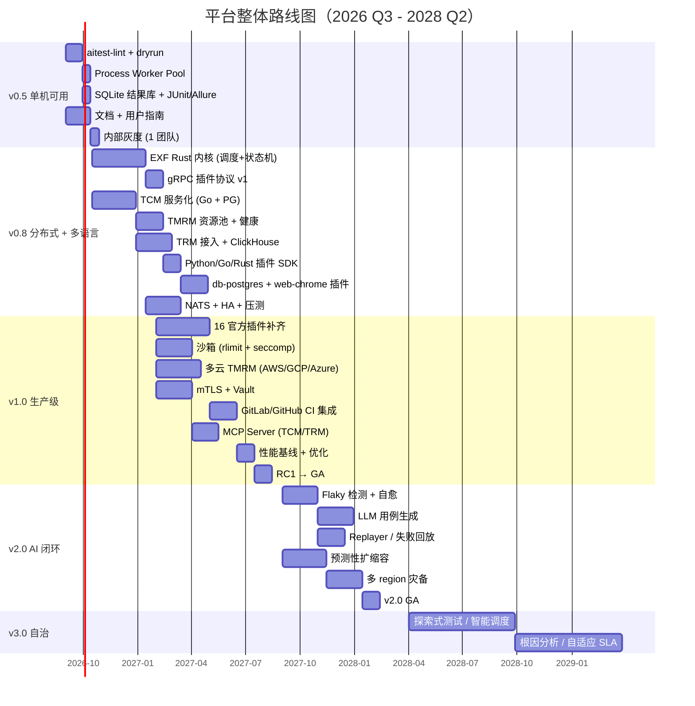
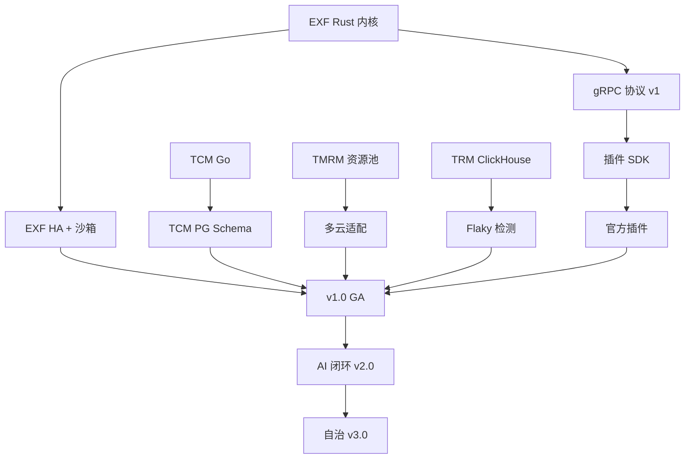

# 整体开发计划 — AI 时代测试平台

> 版本：v1.0 · 日期：2026-08-30  
> 范围：**整个测试平台** 的端到端开发路线，含 5 大模块（TCM / EXF / TRM / TMRM / PLG）、  
> 基础设施、SDK、内置插件、商业化、文档与培训。  
> 关联：[`requirements.md`](requirements.md) · [`architecture.md`](architecture.md) · 5 个模块设计文档。

---

## 1. 项目愿景与北极星指标

**愿景**：打造可承载 **1 亿用例 / 10K 并发 / 18 类官方插件 / 5+ 云厂商** 的 AI 时代测试基础设施，让 AI 写的代码可被机器和人类共同验证。

| 北极星 | v0.5 | v0.8 | v1.0 | v2.0 |
| --- | --- | --- | --- | --- |
| 在管用例数 | 1K | 10K | 100K | 1M |
| 单集群并发 | 200 | 1K | 10K | 10K |
| 执行吞吐 | 200/分钟 | 2K/分钟 | 5K/分钟 | 10K/分钟 |
| 官方插件数 | 3 (mock) | 2 真实 | 18 | 18 + Hub |
| 接入团队 | 内部 1 | 内部 3 | 外部 5 | 外部 20 |
| 调度 P95 | 200 ms | 50 ms | 50 ms | 30 ms |

---

## 2. 当前状态

| 项 | 状态 |
| --- | --- |
| **设计文档** | ✅ 8 份 / 3051 行 / 39 张 Mermaid 图 |
| **Python 原型** (`src/aitest/`) | ✅ v0.1，~3.5K 行，41 单测通过 |
| **示例用例 / 插件 SDK 草案** | ✅ 7 YAML / 4 插件 |
| **CMDB / 监控 / CI** | ⬜ 未开始 |
| **生产部署** | ⬜ 未开始 |
| **第三方生态** | ⬜ 未开始 |

**评估**：设计完整、实现 5%；从原型到 v1.0 距离约 **~50K 行新代码 / 9-12 人月 / 5 人小队 9-12 个月**。

---

## 3. 总体策略

### 3.1 三个并行工作流



- **工作流 A（性能关键）**：EXF 内核 + 插件协议 + SDK，决定上限
- **工作流 B（数据/治理）**：TCM/TRM/TMRM 决定规模
- **工作流 C（场景落地）**：插件决定能服务哪些场景

三条工作流由 v0.8 起并行推进，每个 sprint 三方各 1-2 人。

### 3.2 阶段切分原则

- 每个版本 **必须能对外 demo**（哪怕只是单模块）。
- 每个版本 **必须通过 SLO 验收**（不是“做完了”）。
- 每个版本 **必须有可下载的发行版**（GitHub Release / 内部包）。

---

## 4. 阶段路线图



---

## 5. 模块开发矩阵（5 模块 × 5 阶段）

每个单元格是该模块在该阶段的目标产出。

| 模块 \ 阶段 | v0.5 | v0.8 | v1.0 | v2.0 | v3.0 |
| --- | --- | --- | --- | --- | --- |
| **TCM** 用例管理 | Python 内存版（已有） | Go + PG（JSONB + tsvector + pgvector），事件溯源，RBAC | 多租户分库，Git Bridge，MCP Server | 自愈触发器，用例推荐 | 自动合成 + 演进 |
| **EXF** 执行框架 | Python 进程池，5 worker | **Rust** 内核 + 调度 + 状态机 + NATS | 高性能 Worker + 沙箱 + mTLS | 智能调度 / 预测 | 自治调度 |
| **PLG** 插件系统 | 4 内置 (py) | gRPC 协议 v1 + Python/Go/Rust SDK + 2 真实插件 | 18 官方插件 + Sidecar + cosign | Plugin Hub + 社区 | 插件市场 |
| **TRM** 报告管理 | JSON 报告 + JUnit | Rust ingest + PG + ClickHouse + Flaky | 全量查询 + 告警 + 导出 + MCP | AI 摘要 + 自愈触发 | 异常聚类 |
| **TMRM** 机器资源 | 静态 worker 列表 | 机器注册 + 心跳 + 分配 + 5 算法 | 多云 + 弹性扩缩 + Quota + 维护 + 计费 | 预测扩容 + 故障预测 | 自愈资源池 |
| **CLI** 工具链 | 完善 6 个子命令 | 配置文件 + 远程 API | 一键部署 + Web UI（轻） | Web UI 全功能 | 智能助手 |
| **SDK** | Python 插件 | Python + Go + Rust | + Java + Node | TS SDK | 跨语言工具 |
| **CI 集成** | GitHub Actions demo | GitLab / Jenkins | 自定义 Runner | 增量缓存 | 自适应 |
| **基础设施** | Docker Compose | K8s Helm Chart | 多 AZ 部署 | 多 region | 跨云 + 边缘 |
| **可观测** | 日志 + 简单指标 | Prometheus + Tempo | OTel 完整 + SLO | 异常检测 | 自治告警 |
| **文档** | 用户指南 | 模块 + 插件开发指南 | 完整文档站 | 案例库 | 视频课程 |
| **培训** | 内部分享 | 插件开发培训 | 公开 Webinar | 认证体系 | 合作伙伴 |

---

## 6. 关键路径与依赖



**关键路径**：EXF Rust 内核 → gRPC → SDK → 插件 → v1.0 GA。  
**并行支线**：TCM、TRM、TMRM 可与 EXF 并行，但要在 v0.8 末对齐接口。

---

## 7. 资源与团队

### 7.1 团队规模演进

| 阶段 | 总人数 | 构成 |
| --- | --- | --- |
| v0.1（已完） | 2 | 架构师 + 全栈 |
| v0.5 | 2-3 | + 1 工具链 |
| v0.8 | 3-4 | + 1 后端 (Go) |
| v1.0 | 5-6 | + 1 SRE + 1 插件工程师 |
| v2.0 | 6-7 | + 1 AI 工程师 |
| v3.0 | 8-10 | + 2 研究员 |

### 7.2 角色矩阵

| 角色 | 占比 | 主要交付 |
| --- | --- | --- |
| **架构师** | 1 | 设计 review、关键决策、ADR、跨模块协调 |
| **EXF 工程师 (Rust)** | 1-2 | EXF 内核、gRPC、性能优化 |
| **后端工程师 (Go)** | 1-2 | TCM / TRM / TMRM 服务化 |
| **插件工程师** | 1 | 18 个官方插件 + 第三方 SDK |
| **SRE / DevOps** | 1 | K8s、CI、监控、灾备 |
| **AI 工程师** | 0.5-1 | LLM 集成、Flaky、自愈（v2.0 起） |
| **测试 / QA** | 0.5-1 | 框架自身测试、性能基线、验收 |
| **技术写作** | 0.5 | 文档、教程、培训 |

### 7.3 基础设施预算（年）

| 资源 | v0.5 | v0.8 | v1.0 | v2.0 |
| --- | --- | --- | --- | --- |
| K8s 集群 | - | $300/月 | $1.5K/月 | $5K/月 |
| PG + ClickHouse + Redis | - | $200/月 | $800/月 | $3K/月 |
| S3 / 对象存储 | - | $50/月 | $200/月 | $1K/月 |
| LLM API | - | - | $300/月 | $1.5K/月 |
| 杂项（CDN、DNS、域名） | $30/月 | $50/月 | $100/月 | $300/月 |
| **合计** | **$30/月** | **$600/月** | **$2.9K/月** | **$10.8K/月** |

---

## 8. 基础设施演进

| 阶段 | 部署形态 | 关键组件 |
| --- | --- | --- |
| v0.5 | Docker Compose | `aitest` 单容器 + SQLite + 本地 |
| v0.8 | K8s 单集群 | Helm Chart + NATS + PG + Redis |
| v1.0 | K8s 多 AZ | + ClickHouse + S3 + Vault + Prometheus + Tempo + cosign |
| v2.0 | K8s 多 region | + 跨区复制 + LLM 网关 + Plugin Hub |
| v3.0 | 跨云 + 边缘 | AWS/GCP/Azure + 边缘节点 |

---

## 9. 质量保证

### 9.1 测试策略

| 层 | 工具 | 覆盖率目标 |
| --- | --- | --- |
| 单元 | Rust `cargo test` / Go `go test` / Python `pytest` | 80%+ |
| 集成 | docker-compose 测试套 | 关键路径 100% |
| 端到端 | e2e harness | 全部模块联动场景 |
| 性能 | k6 / wrk / criterion / vegeta | 调度 / 分发 / 查询 P95 |
| 混沌 | chaos-mesh | worker 崩溃 / 网络分区 / broker 宕 |
| 安全 | Trivy / cosign / OPA | 镜像扫描 / 签名 / 策略 |

### 9.2 验收门槛

每个阶段必须满足：

- [ ] 所有 FR / NFR 验收项通过
- [ ] 性能基线达标
- [ ] 安全审计通过（v1.0+）
- [ ] 文档完整度 > 90%
- [ ] 内部团队 NPS > 30
- [ ] 至少 1 个外部 beta 客户跑通

---

## 10. 关键风险与缓解

| 风险 | 概率 | 影响 | 缓解 |
| --- | --- | --- | --- |
| EXF Rust 重写延期 | 中 | 高 | v0.5 保留 Python EXF + 性能优化；并行试点 |
| 插件生态冷启动 | 高 | 高 | 18 个官方插件 + 云厂商合作 + Plugin Hub |
| 性能不达 SLO | 中 | 高 | v0.8 起每阶段压测 + 性能基线 |
| LLM 不可控 | 中 | 中 | lint + dryrun + 评审护栏（v1.0 才正式开放） |
| 安全合规 | 中 | 高 | v1.0 同步 mTLS / RBAC / 审计 |
| 人员流动 | 中 | 中 | 设计文档 + ADR + 关键决策 review |
| 范围蔓延 | 高 | 中 | 每个版本有“必做 / 不做”清单 |
| 跨模块协调 | 中 | 中 | 每周架构例会 + 接口冻结日 |

---

## 11. 商业化与开源策略

### 11.1 开源 vs 商业

| 范围 | 开源 (Apache 2.0) | 商业 |
| --- | --- | --- |
| TCM / EXF / TRM / TMRM / PLG 核心 | ✅ | — |
| 18 个官方插件 | ✅ | — |
| 文档、SDK | ✅ | — |
| 单集群部署 | ✅ | — |
| 多 region / 跨云 | — | ✅ |
| Plugin Hub 商业插件 | — | ✅ |
| 控制台（Web UI 完整版） | 基础 | ✅ |
| 7×24 SLA 保障 | — | ✅ |
| AI 闭环（自愈 / 生成） | 基础 | ✅ 高级 |

### 11.2 商业模式（候选）

- **开源核心 + 商业控制面**：社区版免费，企业版（控制台 + 多 region + SLA）按年订阅
- **Plugin Hub 抽成**：第三方插件上架收 30% 流水
- **专业服务**：定制插件开发、迁移、培训

### 11.3 时间表

| 时点 | 动作 |
| --- | --- |
| v0.8 | 决定开源协议 + 商标 |
| v1.0 末 | 公开 GA，GitHub + 官网 |
| v1.0 + 3 月 | 上线 Plugin Hub Beta |
| v2.0 末 | 商业控制面 Beta |
| v2.0 + 6 月 | 商业 GA |

---

## 12. 沟通与协作

| 频率 | 会议 | 参与人 |
| --- | --- | --- |
| 每日 | Stand-up | 全员 |
| 每周 | Sprint Planning + Review | 全员 |
| 每周 | 架构例会 | 架构师 + 各 lead |
| 每月 | Roadmap review | 全员 + 利益相关方 |
| 每季 | 客户访谈 / NPS | PM + 架构师 |
| 实时 | Slack/飞书 | 全员 |

文档规约：
- 设计 / 决策记 ADR（Architecture Decision Record）
- 每个 PR 关联 issue + 测试
- 每版本发 Release Notes

---

## 13. 成功指标（OKR 模板）

### 13.1 v0.5 OKR

- **O**：让现有原型可在 CI 中跑通
- **KR1**：`aitest-lint` 在 CI 中拦截 ≥ 50% 坏用例
- **KR2**：`aitest-dryrun` 跑通 3 类插件
- **KR3**：内部 1 个团队接入并跑 200 用例
- **KR4**：性能基线文档 + dashboard 发布

### 13.2 v1.0 OKR

- **O**：可对外 GA
- **KR1**：5 个外部 beta 团队跑通 100K 用例
- **KR2**：NPS ≥ 40
- **KR3**：调度 P95 ≤ 50 ms，分发 P95 ≤ 200 ms
- **KR4**：18 个官方插件全部可用
- **KR5**：文档完整度 ≥ 90%

### 13.3 v2.0 OKR

- **O**：AI 闭环可用
- **KR1**：flaky 自动修复率 ≥ 30%
- **KR2**：LLM 生成用例每周 ≥ 100 / 团队
- **KR3**：Replayer 复现成功率 ≥ 95%
- **KR4**：多 region RTO ≤ 5 min

---

## 14. 关键决策（需要 review）

| 决策 | 候选 | 推荐 | 时点 |
| --- | --- | --- | --- |
| EXF 核心语言 | Rust / Go | **Rust** | v0.5 末 |
| TCM 核心语言 | Go / Rust | **Go** | v0.5 末 |
| 默认 broker | NATS / Redis / Kafka | **NATS** | v0.8 |
| 状态机存储 | PG / Redis | **PG** | v0.8 |
| 沙箱默认模型 | Sidecar / Remote | **Sidecar** | v1.0 |
| 插件签名 | cosign / 自研 | **cosign** | v1.0 |
| 商业模型 | 开源核心 / 纯商业 / 双轨 | **双轨** | v1.0 末 |
| License | Apache 2.0 / BSL / 商业 | **Apache 2.0** | v0.8 末 |
| AI 闭环开放 | 立即开放 / v2.0 开放 | **v2.0 开放** | v2.0 |

---

## 15. 立即可启动（v0.5 Sprint 1：2 周）

```
1. aitest-lint 完整规则           3d
2. aitest-dryrun py/sh/llm mock   4d
3. 进程级 Worker Pool              2d
4. SQLite Result-Store + 报告      3d
5. 用户文档 + 入门教程             2d
6. 性能基线 + dashboard            1d
```

两周后能对内 demo、CI 集成示例、文档可读。

## v0.5 α 完成情况（2026-08-30）

- ✅ `core/state.py` — 10 个状态 + 合法转移表 + IllegalTransition
- ✅ `core/store.py` — SQLite Result-Store（upsert / get / list_by_case / list_by_plan / list_by_status / summary / recent）
- ✅ `core/worker.py` — `WorkerPool` 进程级并发（spawn context）、`Task` / `RetryPolicy`、硬超时（SIGTERM → SIGKILL）、失败分类重试、可选持久化到 Result-Store
- ✅ `core/runner.py` — 输出对齐 `Status` 大写（SUCCESS / FAILED / TIMEOUT / CANCELED / BLOCKED / ERROR）
- ✅ `examples/run_with_worker_pool.py` — 5 个 demo 全通过：串行 / 并发 / 硬超时 / 重试 / Store 查询
- ✅ 单测：41 老 + 20 新 = 61/61 通过
- ⬜ `aitest-lint` 完整规则（按用户要求延后）
- ⬜ `aitest-dryrun`（延后）
- ⬜ `Result-Store` 集成进 CLI（默认不开，可用 `--store` 启用）

## 关键决策记录（v0.5 α）

- **状态值大小写**：以设计文档为准采用 `SUCCESS/FAILED/TIMEOUT` 大写；老 `passed/failed` 小写已迁移
- **进程模型**：v0.5 用 Python `multiprocessing.spawn`（避免 fork 继承副作用），不依赖 gRPC
- **超时实现**：子进程 + `terminate()` (SIGTERM) 1s 后 `kill()` (SIGKILL) 兜底
- **重试策略**：默认 `max_attempts=1`（不重试），`retry_on` 白名单（FAILED / TIMEOUT / TRANSIENT）
- **失败 → 终态**：子进程内任何异常映射为 `ERROR` 终态，确保状态机合法


---

## v0.5 β 完成情况（2026-08-30）

> 接续 v0.5 α：把核心引擎与持久化、CLI、子进程插件协议三块对用户暴露，并补齐干跑模式。

### 交付清单

- ✅ **CLI 集成 Result-Store**：`aitest run --store PATH --concurrency N`，每次 case 完成即 `upsert`
- ✅ **CLI 暴露查询**：`aitest results --store --case --plan --status --limit --summary`
- ✅ **CLI 暴露干跑**：`aitest dryrun --suite` 强制使用 mock 插件，零副作用
- ✅ **JSON-over-stdio 插件协议**：`plugin_proto/` 模块
  - `protocol.py` — frame 协议（`HELLO` / `MANIFEST` / `INVOKE` / `ASSERT` / `SHUTDOWN`）
  - `server.py` — 父进程侧，spawn 子进程并按请求路由到对应 handler
  - `client.py` — 子进程侧，stdio JSONL 收发
  - `mock.py` — 内置 `mock.py / llm.echo` 等假目标，零网络
- ✅ **`plugin-server` 子命令**：启动 stand-alone 协议服务（为 v0.8 gRPC 桥做准备）
- ✅ **示例脚本**：`examples/plugin_protocol.py` 跑通 4 个 e2e 场景（实插件 / 干跑 / mock / LLM judge）
- ✅ **单测**：10 新增 `test_plugin_proto.py`，全部 66/66 通过

### 架构演进

```
┌────────────────────────────────────────────────────────────┐
│ CLI: run / results / dryrun / plugin-server                │
└────────────────────────────────────────────────────────────┘
            │                          │
            ▼                          ▼
  ┌──────────────────┐       ┌──────────────────────────┐
  │ Runner + Worker  │       │ PluginProto (stdio JSON) │
  │      Pool        │──────►│  parent  ⇄  child        │
  └────────┬─────────┘       └──────────────────────────┘
           │
           ▼
   ┌──────────────┐    ┌────────────────────┐
   │ Result-Store │    │ Mock registry      │
   │  (SQLite)    │    │ (dryrun / tests)   │
   └──────────────┘    └────────────────────┘
```

### 关键决策记录（v0.5 β）

- **插件协议先行 stdio JSON**：v0.5 不引入 gRPC 依赖；JSONL over stdio 足够覆盖 manifest/invoke/assert 三个动作，避免给原型阶段加锁
- **`dryrun` 强制 mock**：用 `--dryrun` 时不查 `target` 字段，直接走 `mock.registry`，任何插件都可无副作用地跑完
- **结果即时 upsert**：子进程一返回 `Status` 终态，父进程立即写 SQLite；崩溃也不丢已完成的数据
- **CLI 字段对齐设计文档**：`--store / --concurrency / --recorder` 与 `Result-Store` 设计中的字段一一对应
- **`plugin-server` 子命令**：先以 stdio 模式独立运行，方便 v0.8 替换为 gRPC 时保持兼容

### 待办（v0.5 γ 候选）

- ⬜ aitest-lint 完整规则（按用户要求继续延后）
- ⬜ `--plan` 跑批编排（一次跑多 suite）
- ⬜ `--junit-xml` 报告输出
- ⬜ 进程内超时从 SIGTERM 升级为信号量 + watchdog 协程（Python 限制）
- ⬜ gRPC 插件协议骨架（v0.8 预研）

---

## v0.5 γ 完成情况（2026-08-30）

> 接续 v0.5 β：把 TRM (Test Report Management) 子系统的 Python 原型落地，作为独立模块边界。

### 交付清单

- ✅ **`src/aitest/trm/` 新模块**：从 EXF 解耦的高阶分析层
  - `analyzer.py` — `Analyzer` 抽象 + `AnalyzerRegistry`，方便 v1.0 接入 ClickHouse / Postgres 适配器
  - `flaky.py` — 滑动窗口 N=50，失败比例 ∈ [5%, 50%] → 标记 flaky，输出 `FlakyCase` 数据类
  - `baseline.py` — 两 run 之间 7 类 diff（NEW_FAILURE / FIXED / REGRESSION / STILL_FAIL / STILL_PASS / NEW_PASS / MISSING）
  - `trend.py` — 单 case 状态时间线 + pass_rate + duration p50/p95 + 长尾告警
  - `store.py` — EXF store 的轻包装（dict-of-rows），降低跨模块耦合
- ✅ **CLI 子命令 `aitest report`**：
  - `report flaky --store X.db --plan --window --min-ratio --max-ratio [--json]`
  - `report baseline --store X.db --baseline planA --current planB [--json]`
  - `report trend --store X.db --case X --window 50 [--json]`
- ✅ **单测**：18 新增 `test_trm.py`，全部 84/84 通过（66 旧 + 18 TRM）
- ✅ **架构边界**：TRM 只读 EXF store，互不依赖；未来切换 ClickHouse 只换 Adapter

### 架构演进

```
                ┌────────────────────────────────┐
                │ CLI: aitest report {flaky,…}   │
                └──────────────┬─────────────────┘
                               ▼
       ┌──────────────────────────────────────────┐
       │  TRM  (src/aitest/trm/)                  │
       │  ─ Analyzer 协议 / AnalyzerRegistry      │
       │  ─ FlakyDetector / BaselineComparator   │
       │  ─ TrendAnalyzer                         │
       │  ─ Store Adapter (当前: SQLite)          │
       └─────────────────┬────────────────────────┘
                         │  只读
                         ▼
       ┌──────────────────────────────────────────┐
       │  EXF Result-Store (SQLite)               │
       └──────────────────────────────────────────┘
                         ▲ 写入
                         │
       ┌──────────────────────────────────────────┐
       │  EXF Runner / WorkerPool                 │
       └──────────────────────────────────────────┘
```

### 关键决策记录（v0.5 γ）

- **TRM 解耦 EXF**：通过 `Analyzer` 协议 + Adapter store 接口，保证后续把 store 换成 ClickHouse / Postgres 时只需新增 Adapter
- **`run()` 接受 store 为位置参数**：避免 keyword-only 给调用方制造噪声
- **基线对比分 7 类**：覆盖"新增 / 消失 / 修复 / 回归"四个方向，避免仅区分 pass/fail
- **flaky 区间用闭区间**：5% 和 50% 都算 flaky（5/100 是工程上常见的边缘 case）
- **trend 自动长尾告警**：p95/p50 > 3x 触发建议，覆盖性能退化场景

### 待办（v0.5 δ 候选）

- ⬜ TMRM (Test Machine Resource Management) Python 原型
- ⬜ TRM → ClickHouse Adapter 预研
- ⬜ `report export` 子命令（JUnit XML / HTML / PDF）
- ⬜ Alert 规则引擎（按 summary 阈值告警）
- ⬜ `--plan` 跑批编排（一次跑多 suite，v0.5 β 已列）
- ⬜ gRPC 插件协议骨架（v0.8 预研）

---

## v0.5 δ 完成情况（2026-08-30）

> 接续 v0.5 γ：把 TMRM (Test Machine Resource Management) 子系统的 Python 原型落地。

### 交付清单

- ✅ **`src/aitest/tmrm/` 新模块**：独立 farm registry
  - `machine.py` — `Machine` / `MachineStatus` / `MachineType` / `Selector`（labels AND 关系）
  - `pool.py` — `Pool`（机器池 + selectors 自动注册）
  - `session.py` — `Session` 生命周期（含 TTL/expired 检查）
  - `store.py` — SQLite 注册表（machines / pools / sessions / health_records 四张表）
  - `quota.py` — `Quota` / `QuotaPolicy`（按 team × pool 维度）
  - `allocator.py` — `Allocator.acquire/release` + 配额检查 + NoMatch 异常
  - `health.py` — `HealthChecker` + `HealthRecord` + 默认探针（heartbeat stale 检测）
- ✅ **CLI 子命令 `aitest farm`**：
  - `farm ls [--status] [--type] [--pool]` / `--json`
  - `farm register --id --name --type --provider --region --pool --label k=v`
  - `farm acquire --owner [--type] [--pool] [--label...] [--plan] [--task] [--ttl]`
  - `farm release --session`
  - `farm heartbeat --machine`
  - `farm health-check --machine`
  - `farm sweep` — 扫所有机器
  - `farm sessions [--owner] [--status]`
- ✅ **单测**：19 新增 `test_tmrm.py`，全部 103/103 通过（66 旧 + 18 TRM + 19 TMRM）
- ✅ **E2E 验证**：register → acquire → sessions → release → heartbeat → sweep 全链路 OK

### 架构演进

```
                ┌──────────────────────────────────────┐
                │ CLI: aitest farm {ls, register, ...} │
                └────────────────┬─────────────────────┘
                                 ▼
       ┌────────────────────────────────────────────────┐
       │  TMRM  (src/aitest/tmrm/)                      │
       │  ─ Allocator  (acquire / release)              │
       │  ─ HealthChecker  (heartbeat / sweep)          │
       │  ─ QuotaPolicy  (team × pool 维度)             │
       │  ─ FarmStore  (SQLite 当前)                    │
       └────────────────┬───────────────────────────────┘
                        │  机器列表 → 调度
                        ▼
       ┌────────────────────────────────────────────────┐
       │  EXF Runner / WorkerPool                       │
       │  (调度时优先消耗 TMRM 已分配的机器)             │
       └────────────────────────────────────────────────┘
```

### 关键决策记录（v0.5 δ）

- **Selector 留空即非法**：`Allocator.acquire` 拒绝空 selector，避免误扫所有机器
- **acquire 是同步 + 强一致**：成功 = 机器状态 + session 两件事都落 SQLite（先机器、后 session）
- **quota 维度仅在 pool_id 存在时生效**：未配置 = 不限，避免误伤 ad-hoc 任务
- **health 默认探针用 heartbeat age**：原型阶段不强依赖 ssh / docker；真实环境替换 Probe 实现即可
- **`farm sweep` 不强制 RETIRED**：退役机器直接过滤掉，避免被新检查反复标记

### 待办（v0.5 ε 候选）

- ⬜ TMRM ↔ EXF 集成：`farm acquire` 直接给 WorkerPool 喂机器
- ⬜ 真实 Probe（ssh / http / docker）
- ⬜ 多 pool 嵌套 selector
- ⬜ Auto-scale 触发器（基于 pending sessions）
- ⬜ 计费 & 维护窗口（设计文档已写，等 v1.0）

---

## v0.5 ε 完成情况（2026-08-30）

> 接续 v0.5 δ：把 TCM (Test Case Management) 子系统从 EXF core 抽出来，作为独立模块。

### 交付清单

- ✅ **新建 `src/aitest/tcm/` 包**：
  - `case.py` — 从 `core/case.py` 迁过来（`Case` / `CaseStep` / `CaseAssert` / `CaseRecord`）
  - `suite.py` — 从 `core/suite.py` 迁过来（`Suite` + 矩阵展开 + 标签查询）
  - `registry.py` — 从 `core/registry.py` 迁过来（命令 / 断言 / Provider / Observer 注册中心）
  - `render.py` — 从 `core/render.py` 迁过来（模板解析 + 过滤器）
  - `lifecycle.py` — **新增**：状态机（draft → active → deprecated → retired）+ `IllegalTransition`
  - `version.py` — **新增**：`content_hash()` (SHA-256 前 12 位，剔除 path/时间戳) + `semver` parse/format/bump
  - `diff.py` — **新增**：`CaseDiff` / `StepDiff` / `diff_cases()` / `diff_suites()`
- ✅ **向后兼容 shim**：`core/case.py` / `core/suite.py` / `core/registry.py` / `core/render.py` 全部改为 re-export，老代码 `from aitest.core.case import Case` 仍可用
- ✅ **CLI 子命令 `aitest case`**：
  - `case lifecycle [--suite] [--id] [--to {draft,active,deprecated,retired}] [--json]` — 查询 / 模拟状态转移
  - `case diff --a PATH --b PATH [--pattern] [--json]` — 两 suite 语义 diff
  - `case version [--suite] [--id] [--bump {major,minor,patch}] [--json]` — content hash + semver
- ✅ **单测**：23 新增 `test_tcm.py`，全部 126/126 通过（103 旧 + 23 TCM）
- ✅ **架构边界**：TCM 完全独立，与 EXF / TRM / TMRM 仅通过 import 解耦

### 架构演进

```
  ┌────────────────────────┐         ┌─────────────────────────┐
  │ TCM  (src/aitest/tcm/) │         │ EXF core/               │
  │  - case / suite        │         │  - runner / worker      │
  │  - lifecycle           │  消费   │  - state machine        │
  │  - version             │ ──────► │  - store                │
  │  - diff                │ Case    │  - context / result     │
  │  - registry / render   │         │  - errors               │
  └────────────────────────┘         └─────────────────────────┘
           ▲                                 │
           │                                 │
           │        ┌────────────────┐        │
           └────────│ shim (re-export)│────────┘
                    │ core/case etc. │
                    └────────────────┘
```

### 关键决策记录（v0.5 ε）

- **shim 而不是 move**：core/case.py 改为 1 行 `from ..tcm.case import *`，所有 import 点不动；测试一次性全过
- **lifecycle 不写回 YAML**：v0.5 ε 只校验 + 模拟，v1.0 接 GitOps 后再落库（避免本地写文件污染）
- **content_hash 剔除 path/时间戳**：让 hash 跟随"用例语义"，不跟随"位置 / 时间"
- **diff 分 meta + steps 两段**：meta 字段直接比较；steps 字段按"长度变化 + 列表 diff"两阶段
- **`can_run` 只允许 ACTIVE / DEPRECATED**：DRAFT 不被 EXF 执行；RETIRED 完全终止

### 待办（v0.5 ζ 候选）

- ⬜ PLG: 实现一个真实插件（如 db-sqlite / web-chrome），验证 stdio 协议完整链路
- ⬜ EXF ↔ TMRM 集成：`aitest run --farm` 自动 acquire 机器后喂给 WorkerPool
- ⬜ aitest-plan 跑批编排：一次跑多 suite
- ⬜ JUnit XML 报告输出（TRM export）
- ⬜ gRPC 插件协议骨架（v0.8 预研）

---

## v0.5 ζ 完成情况（2026-08-30）

> 接续 v0.5 ε：把 EXF (WorkerPool) 与 TMRM (Allocator) 接通 —— `aitest run --farm`。

### 交付清单

- ✅ **`aitest run --farm`** —— 一个标志把两个子系统连起来
  - 新增参数：`--farm PATH --farm-type {host,browser,mobile,desktop,sandbox} --farm-owner NAME`
  - 行为：run 开始前 acquire N 台机器（concurrent = N），run 结束后全部 release
  - 失败时已分配的也回滚
- ✅ **会话级联 plan_id**：每次 run 生成新 `plan_id = run-<uuid>`，写进 session 表，方便 TRM 之后聚合
- ✅ **单测**：4 新增 `test_exf_tmrm.py`，全部 130/130 通过
  - 正常 acquire → run → release 链路
  - 无可用机器时退出码 2 + 错误提示
  - 不带 --farm 时不影响老路径
  - session 表正确持久化 plan_id / owner / status

### 架构演进

```
              ┌──────────────────────────────────────────┐
              │ CLI: aitest run  --farm / --concurrency │
              └──────────────────┬───────────────────────┘
                                 │
                                 ▼
       ┌────────────────────────────────────────────────┐
       │  EXF WorkerPool                                │
       │   ├ acquire N machines (TMRM)                  │
       │   ├ run N tasks in subprocesses                │
       │   └ release N machines (TMRM, even on failure) │
       └────────────────┬───────────────────────────────┘
                        │
                        ▼
       ┌────────────────────────────────────────────────┐
       │  TMRM Allocator / FarmStore                    │
       └────────────────────────────────────────────────┘
```

### 关键决策记录（v0.5 ζ）

- **失败即回滚**：acquire 部分成功时立刻 release 已分配，避免机器长期占着
- **plan_id = run-<uuid>**：与 EXF 跑批对齐，方便 TRM 后期做"按 plan 对比 baseline"
- **--farm-owner 默认 anon**：方便 ad-hoc 跑批；后续 quota 检查已留接口

### 待办（v0.5 η 候选）

- ⬜ PLG: 真实插件（db-sqlite / web-chrome），验证 stdio 协议完整链路
- ⬜ aitest-plan：跑批编排（一次跑多 suite）
- ⬜ TRM export（JUnit XML / HTML / PDF）
- ⬜ TCM lifecycle 写回（GitOps 落地）
- ⬜ gRPC 插件协议骨架（v0.8 预研）

---

## v0.5 η 完成情况（2026-08-30）

> 接续 v0.5 ζ：PLG (Plugin) 子系统第一个真实插件 —— `db_sqlite`，验证 stdio JSON 协议全链路。

### 交付清单

- ✅ **`src/aitest/plugins/` 新包**：
  - `db_sqlite.py` — 真实 SQLite 插件（stdlib only，零外部依赖）
    - commands: `db.connect` / `db.query` / `db.exec` / `db.close` / `db.tables`
    - assertors: `db.row_count` / `db.cell_eq` / `db.col_eq`
    - 模块级 `_CONNS` 字典：跨 stdio RPC 调用保持连接（plugin-server 长生命周期）
  - `discovery.py` — `PluginMeta` 数据类 + `list_builtin()` / `get(name)`，v1.0 接 entry_points
- ✅ **`plugin-server --plugin db_sqlite`**：从 cli.py 选择加载某个内置插件（默认仍是全量注册表）
- ✅ **CLI 子命令 `aitest plugin`**：
  - `plugin ls` — 列出内置插件
  - `plugin info NAME` — 查看详情
  - 都支持 `--json`
- ✅ **示例脚本**：
  - `examples/db_sqlite_e2e.py` — 进程内（直接调 Registry）跑 7 步场景
  - `examples/db_sqlite_stdio.py` — 走 stdio JSON 全链路：spawn plugin-server → invoke → assert → close
- ✅ **单测**：18 新增 `test_plugins.py`，全部 148/148 通过
  - discovery / connect / close / exec / query / assertors / manifest

### 架构演进

```
  ┌──────────────────────────────────────────────────────┐
  │ CLI: aitest plugin {ls,info}                         │
  │      aitest plugin-server --plugin db_sqlite         │
  └──────────────────────┬───────────────────────────────┘
                         ▼
  ┌──────────────────────────────────────────────────────┐
  │ PLG (src/aitest/plugins/)                            │
  │  - discovery     (内置清单)                          │
  │  - db_sqlite     (命令 + 断言 + 模块级连接池)         │
  └──────────────────────┬───────────────────────────────┘
                         │ stdio JSON
                         ▼
  ┌──────────────────────────────────────────────────────┐
  │ plugin_proto/server.py                               │
  │  - manifest / invoke / assert                        │
  └──────────────────────────────────────────────────────┘
```

### 关键决策记录（v0.5 η）

- **模块级 _CONNS 而不是 ctx.meta**：stdio RPC 每次 invoke 都构造新 Context，跨调用共享状态必须用进程级字典
- **discovery 起步用硬编码**：v0.5 η 不引入 importlib.metadata，v1.0 切到 entry_points
- **plugin-server --plugin 接受单一插件名**：组合多插件留到 v1.0（YAML 配置）
- **assertor.check 不返回 bool，抛 AssertFailure**：与 EXF 状态机对齐

### 待办（v0.5 θ 候选）

- ⬜ aitest-plan 跑批编排（一次跑多 suite）
- ⬜ TRM export（JUnit XML / HTML）
- ⬜ 更多内置插件（http 复用 / llm.echo / python.eval）
- ⬜ gRPC 插件协议骨架（v0.8 预研）
- ⬜ EXF WorkerPool 把 machine_id 透传给 Task

---

## 16. 文档与培训

| 阶段 | 文档 | 培训 |
| --- | --- | --- |
| v0.5 | 用户指南、快速开始、CLI 参考 | 内部 1 次分享 |
| v0.8 | 模块设计、插件开发指南、运维指南 | 插件开发培训（2 天） |
| v1.0 | 完整文档站、API 参考、最佳实践、案例 | 公开 Webinar（3 场） |
| v2.0 | AI 闭环指南、案例库 | 认证体系（Lv1-3） |
| v3.0 | 视频课程、合作伙伴培训 | 联合实验室 |

---

## 17. 关键里程碑一览

| 时点 | 里程碑 | 标志 |
| --- | --- | --- |
| 2026-08 | v0.1 GA | Python 原型 + 35 单测通过 |
| 2026-10 | v0.5 GA | lint + dryrun + 进程池，1 团队灰度 |
| 2027-01 | v0.8 RC | EXF Rust + TCM Go + gRPC 插件 |
| 2027-07 | **v1.0 GA** | 18 插件 + 沙箱 + 多云 + CI + MCP |
| 2028-04 | v2.0 GA | AI 闭环 + 多 region |
| 2028-10 | v3.0 GA | 自治测试 |

