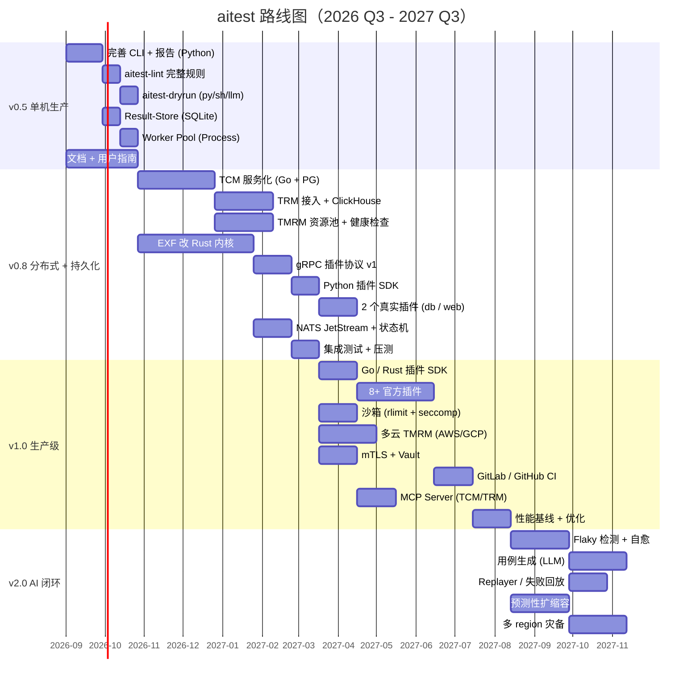

# 开发计划 — AI 时代测试框架与用例管理

> 版本：v1.0 · 日期：2026-08-30  
> 范围：把 `aitest` 从 **Python 单进程原型** 推进到 **可扩展、高性能、可生产** 的 v1.0。  
> 关联：[`requirements.md`](requirements.md) · [`architecture.md`](architecture.md) · 五个模块设计文档。

---

## 1. 当前状态

| 项 | 状态 |
| --- | --- |
| Python 原型 `aitest` v0.1 | ✅ 已完成（~3.5K 行，41 个单测通过） |
| 用例 / 执行 / 插件 / 报告 / 资源 5 大模块设计 | ✅ 已完成（~2.8K 行文档，38 张 Mermaid 图） |
| 单机可用版本 v0.5 | ⬜ 未开始 |
| 分布式 + 多语言插件 v0.8 | ⬜ 未开始 |
| 生产级 v1.0 | ⬜ 未开始 |
| AI 闭环 v2.0 | ⬜ 未开始 |

**核心结论**：设计齐备、代码只 5%；距 v1.0 大约还需 **~50K 行新代码 / 9-12 人月 / 5 人小队**。

---

## 2. 总体路线图

---

## 3. 阶段详解

### v0.5 — 单机生产可用（4-6 周 / 2 人）

**目标**：让现有 Python 原型在 CI / 中小团队中真正可用，配齐 lint / dryrun / 报告 / 进程池。

| 任务 | 产出 | 验收 |
| --- | --- | --- |
| `aitest-lint` 完整规则 | 静态检查插件参数 schema、模板变量、命名风格、死引用 | 100+ 规则，CI 中作为门禁 |
| `aitest-dryrun` (py/sh/llm) | 预演 3 类命令用 mock target | 三类插件 dryrun 跑通，秒级 |
| 进程级 Worker Pool | `multiprocessing` 替换 ThreadPool | 单机 200 并发用例 |
| Result-Store (SQLite) | 本地结果库 + JUnit/Allure 报告 | 1 万条结果查询 < 100 ms |
| 完善 CLI / 配置 | `aitest.yaml` 全局配置 + plan 文件 | 支持 plan 复用 |
| 文档 + 用户指南 | docs/user-guide.md + tutorial | 新人 1 天接入 |

**不做**：分布式、gRPC、PG、TMRM 多云。

---

### v0.8 — 分布式 + 持久化（3 个月 / 3 人）

**目标**：核心模块服务化、EXF 改 Rust 内核、引入 gRPC 插件协议，达成 1K 并发。

| 任务 | 产出 | 验收 |
| --- | --- | --- |
| TCM 服务化 (Go + PG) | HTTP/gRPC API、JSONB + tsvector + pgvector | 100 万用例 写入 500 QPS、查询 5K QPS |
| TRM 接入 (ClickHouse) | Rust ingest + 查询 API + 简单 Flaky | 5K events/s 接入 |
| TMRM 资源池 + 健康 | 机器注册 / 心跳 / 分配器（5 算法） | 100 机器，分配 P95 < 200 ms |
| EXF 改 Rust 内核 | 调度器 / 状态机 / Broker (NATS) | 调度 P95 < 50 ms |
| gRPC 插件协议 v1 | Protobuf + Python SDK | 第三方开发者 1 天出插件 |
| 2 个真实插件 | db-postgres (Rust) / web-chrome (Rust) | 跑通 50+ 真实场景 |
| NATS JetStream | 任务总线 + 状态机持久化 | 5K tasks/s 吞吐 |
| 集成 + 压测 | 端到端 + 性能基准 | 1K 并发用例 5K/分钟 |

**关键决策点**：Rust EXF 内核与 Python CLI 是否并行；TCM 用 Go 还是 Rust。

---

### v1.0 — 生产级（6 个月 / 5 人）

**目标**：可对外发布，支持万级并发、10 类插件、3 大云厂商、安全合规、CI 深度集成。

| 任务 | 产出 | 验收 |
| --- | --- | --- |
| Go / Rust 插件 SDK | 多语言官方 SDK + 文档 | SDK 一致性测试 100% |
| 8+ 官方插件 | shell / http / python / 3 类 db / 2 类 web / llm | 18 个内置插件全部可用 |
| 沙箱 (rlimit + seccomp + overlay) | 三档沙箱 + 凭据注入 | 默认 deny network |
| 多云 TMRM | AWS / GCP / Azure SDK + 扩缩容 | 1K 机器弹性 5 min |
| mTLS + Vault | 内部通信加密 + 凭据托管 | 安全审计通过 |
| CI 集成 | GitLab / GitHub Actions / Webhook | 三家 CI 模板 + 文档 |
| MCP Server (TCM/TRM) | 给 LLM 客户端的协议 | LLM 端到端 demo |
| 性能基线 + 优化 | 调度/分发/插件 P95 SLO | 10K 并发，5K/分钟 |
| 文档完整 | 用户/运维/插件开发文档 | 文档覆盖率 > 90% |

**关键决策点**：插件签名（cosign）、Plugin Hub 设计、收费模型（开源/商业）。

---

### v2.0 — AI 闭环（9 个月 / 6 人）

**目标**：用例自动生成、自愈、失败预测；平台具备自我进化能力。

| 任务 | 产出 | 验收 |
| --- | --- | --- |
| Flaky 检测 + 自愈 | 离线批 + LLM 改写 + dryrun 评审 | 自动修复 30% flaky |
| 用例生成 (LLM) | 输入代码/diff/PR → YAML；lint+dryrun 强制 | 生成 100 用例 / 团队 / 周 |
| Replayer / 失败回放 | 复现 + 训练样本 | 失败回放成功率 > 95% |
| 预测性扩缩容 | 历史负载 + 调度提前 30 min | 资源利用率 +20% |
| 多 region 灾备 | 跨 AZ + 跨 region | RTO < 5 min, RPO < 1 min |

---

### v3.0 — 自治（12+ 个月 / 8 人）

探索式测试 / 失败预测 / 智能调度 / 失败根因分析 / 自适应 SLA。

---

## 4. 资源与团队

### 4.1 推荐团队（v0.5 → v1.0）

| 角色 | 人数 | 主要工作 |
| --- | --- | --- |
| 架构师 | 1 | EXF / TCM / TRM / TMRM 总体设计、Rust 内核 review |
| 后端工程师 (Rust) | 1-2 | EXF 内核、gRPC、SDK、性能优化 |
| 后端工程师 (Go) | 1-2 | TCM / TRM / TMRM 服务化 |
| 插件工程师 | 1 | 18 个内置插件 + 第三方生态 |
| 测试 / SRE | 1 | 压测、CI/CD、部署、监控 |
| AI 工程师 | 0.5（v2.0 起） | LLM 集成、Flaky、自愈 |

### 4.2 基础设施

| 阶段 | 必备 |
| --- | --- |
| v0.5 | Linux dev box、GitHub、Slack |
| v0.8 | K8s 测试集群、PG 16 + pgvector、Redis/NATS |
| v1.0 | 多 AZ 部署、Vault、cosign、Prometheus + Tempo、ClickHouse、S3 |
| v2.0 | 跨 region、向量库、LLM 网关、Plugin Hub |

---

## 5. 关键风险与缓解

| 风险 | 影响 | 概率 | 缓解 |
| --- | --- | --- | --- |
| EXF Rust 重写延期 | v0.8 推迟 | 中 | v0.5 维持 Python EXF + 性能优化；Rust 边角试点 |
| 插件生态不活跃 | 推广受阻 | 高 | 18 个官方插件 + 文档 + 培训；与云厂商合作 |
| 性能不达 SLO | 客户流失 | 中 | v0.8 起每阶段压测 + 性能基线；瓶颈早发现 |
| LLM 不可控 | 生成垃圾用例 | 中 | lint + dryrun + 评审护栏；v1.0 才正式开放 |
| 安全合规 | 不能落地 | 中 | v1.0 同步做 mTLS / RBAC / 审计 |
| 团队人员流动 | 知识断层 | 中 | 详细设计文档 + 录制 ADR；关键决策需 review |

---

## 6. 关键决策点（需要 review）

| 决策 | 候选 | 推荐 | 决策时点 |
| --- | --- | --- | --- |
| EXF 核心语言 | Rust / Go | **Rust**（无 GC、零拷贝、调度热路径） | v0.5 末 |
| TCM 核心语言 | Go / Rust | **Go**（HTTP/SQL 生态成熟、招人容易） | v0.5 末 |
| 默认 broker | NATS / Redis Streams / Kafka | **NATS**（轻量、JetStream 够用） | v0.8 |
| 状态机存储 | PG / Redis | **PG**（强一致 + 可观测） | v0.8 |
| 插件默认进程模型 | Sidecar / Remote | **Sidecar**（K8s 友好） | v1.0 |
| 插件签名 | cosign / in-house | **cosign**（keyless 简单） | v1.0 |
| 商业模型 | 开源 / 商业 SaaS | **开源核心 + 商业控制面** | v1.0 末 |

---

## 7. 立即可启动的下一步（v0.5 Sprint 1：2 周）

按依赖顺序，最快能跑出价值的：

| # | 任务 | 天 | 负责人 | 验收 |
| --- | --- | --- | --- | --- |
| 1 | `aitest-lint` 完整规则（参数 schema、模板变量、命名、死引用） | 3 | A | 100+ 规则，跑通 demo |
| 2 | `aitest-dryrun` Python / Shell / LLM mock | 4 | A | 三类插件预演通过 |
| 3 | `aitest run` 进程级 Worker Pool（`multiprocessing`） | 2 | A | 单机 200 并发 |
| 4 | Result-Store 本地落盘（SQLite）+ JUnit/Allure 报告 | 3 | A | 1 万条结果可查 |
| 5 | 用户文档 + 入门教程 | 2 | A + B | 新人 1 天接入 |
| 6 | 性能基线 + 简单 dashboard | 1 | A | 跑 1K 用例报告 |

**两周后**：能对外 demo；CI 集成示例；文档可读。

---

## 8. 度量与验收节奏

每个阶段必须满足的**硬指标**：

| 阶段 | 用户数 | 用例数 | 并发 | 插件 | 团队满意度 |
| --- | --- | --- | --- | --- | --- |
| v0.5 | 内部 10 人 | 1K | 200 | 3 mock | N/A |
| v0.8 | 内部 50 人 | 10K | 1K | 2 真实 | NPS > 30 |
| v1.0 | 外部 5 团队 | 100K | 10K | 8 真实 | NPS > 40 |
| v2.0 | 外部 20 团队 | 1M | 10K | 18 + Hub | NPS > 50 |

每两周一个 sprint review，月末发版本。

---

## 9. 路线图对照

| 版本 | 里程碑 | 状态 |
| --- | --- | --- |
| v0.1 | Python 原型 | ✅ 2026-08 |
| v0.5 | 单机生产可用 | ⬜ 2026-10 |
| v0.8 | 分布式 + 多语言 | ⬜ 2027-01 |
| v1.0 | 生产级发布 | ⬜ 2027-07 |
| v2.0 | AI 闭环 | ⬜ 2028-04 |

