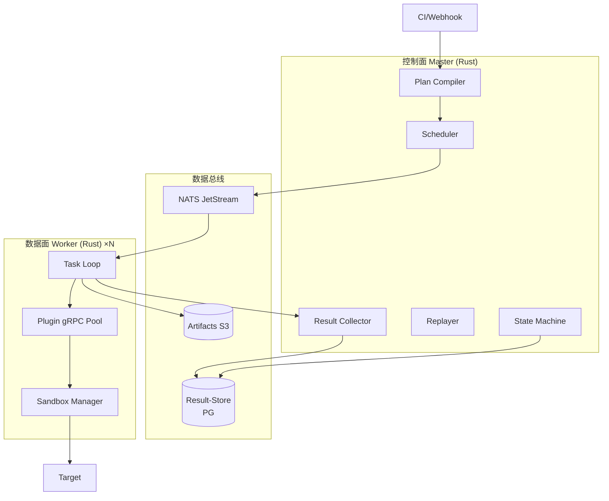
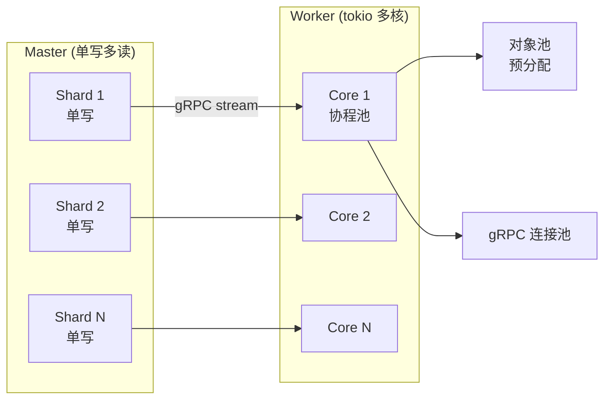
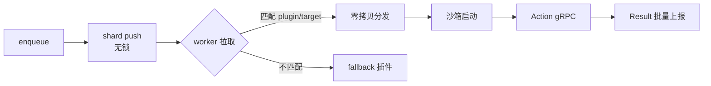
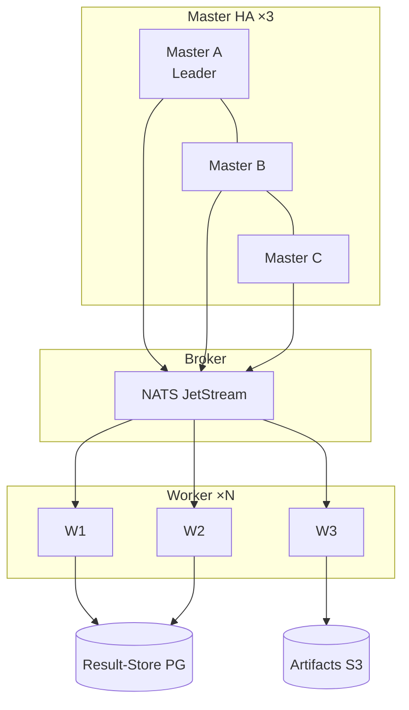
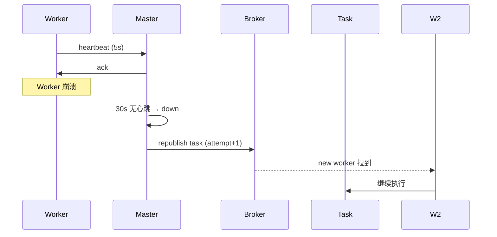
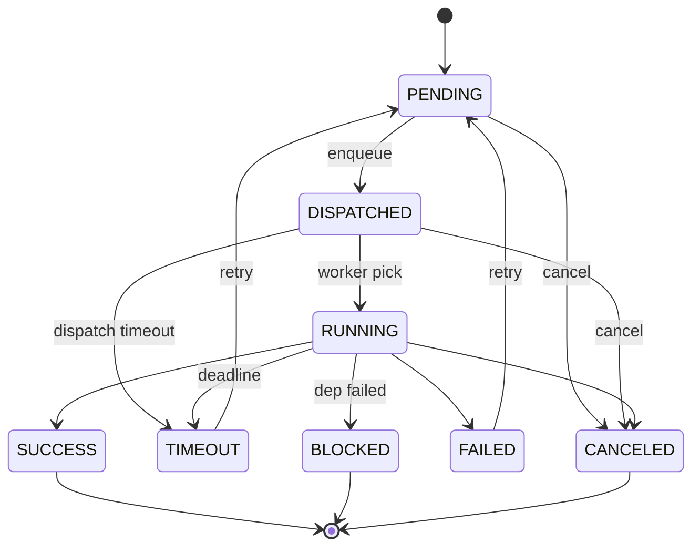
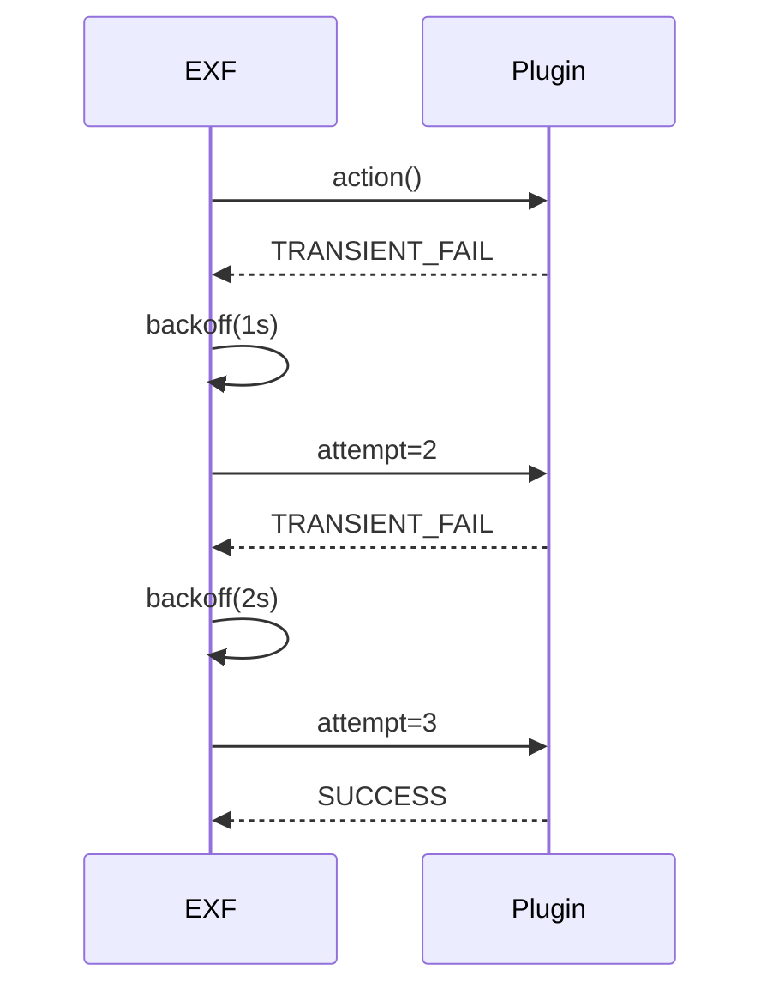
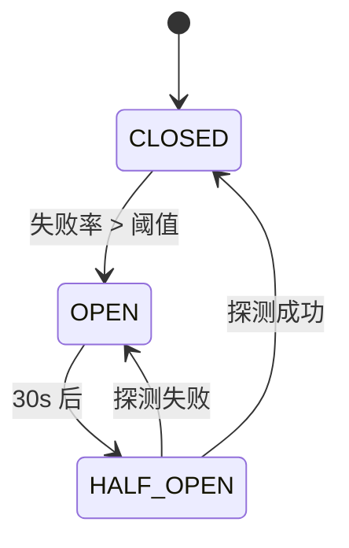

# 执行框架子系统设计文档（EXF）

> 范围：把 **Plan** 变成 **可观测、可控、可扩展** 的高并发执行集群。  
> 关联：[`architecture.md`](architecture.md) · [`requirements.md`](requirements.md) · [`test-case-management-design.md`](test-case-management-design.md) · [`plugin-system-design.md`](plugin-system-design.md)

---

## 1. 定位与边界

### 1.1 核心定位
- **极简内核**：只做“调度 + 协议”，不 import 任何业务 SDK。
- **语言演进**：原型 Python（`aitest` v0.1），**生产 Rust**（v1.0）。Go 仅作为过渡候选。
- **目标规模**：单集群 10K 并发、100K 待执行队列、10K 用例/分钟吞吐。

### 1.2 不做
- 不解析 `actions / asserts` 的业务含义 —— 由插件解释。
- 不存储用例元数据 —— 只读 TCM 的接口。
- 不实现 UI —— 仅提供 API / CLI。

### 1.3 模块依赖
```text
TCM  ──HTTP/gRPC──▶  EXF
Plugin ──gRPC──▶  EXF
EXF ──OTLP──▶  OBS
EXF ──PG/Redis/NATS──▶  Broker / Result-Store
```

## 2. 关键设计原则

| # | 原则 | 落地 |
| --- | --- | --- |
| 1 | 热路径无锁 | Lock-free 队列、RCU、单写多读 |
| 2 | 全异步 I/O | tokio 异步运行时、零拷贝 Protobuf |
| 3 | 协议即接口 | 任何模块通信都走 Protobuf，禁共享内存 |
| 4 | 故障即常态 | 任务幂等、状态机持久化、自动重派 |
| 5 | 资源即约束 | 调度器可见 CPU/Mem/GPU/Network/Plugin |
| 6 | 可灰度 | 插件多版本、Plan 蓝绿、用例版本比 |

## 3. 总体架构




```text
                ┌─────────────────────┐
                │  Plan Trigger        │  HTTP/gRPC (Go/Rust)
                │  - Webhook / Cron   │
                │  - Manual / MR      │
                └────────┬────────────┘
                         ▼
                ┌─────────────────────┐
                │  Plan Compiler      │  (Rust)
                │  - 拉用例 + Target   │
                │  - 编译 DAG          │
                │  - 生成 Task 列表    │
                └────────┬────────────┘
                         ▼
┌────────────────────────────────────────────────────┐
│  Master（控制面）                                   │
│  ┌────────────┐  ┌────────────┐  ┌────────────┐    │
│  │ Scheduler  │  │ State Mach │  │ Replayer   │    │
│  └────┬───────┘  └────┬───────┘  └────┬───────┘    │
│       │               │               │            │
│       └──────┬────────┴───────┬───────┘            │
│              ▼                ▼                    │
│  ┌─────────────────┐  ┌──────────────────┐         │
│  │  Dispatcher     │  │ Result Collector │         │
│  └────────┬────────┘  └────────┬─────────┘         │
│           │                    │                   │
│  ┌────────┴─────────┐  ┌───────┴──────────┐        │
│  │ Broker (NATS/  │  │ Result-Store     │        │
│  │ Redis Streams) │  │ (PG + S3)        │        │
│  └────────┬────────┘  └───────┬──────────┘        │
│           │                   │                   │
└───────────┼───────────────────┼───────────────────┘
            │                   │ gRPC streaming
            ▼                   ▲
┌────────────────────────────────────────────────────┐
│  Worker（数据面）  ×N                               │
│  ┌────────────────────────────────────────┐        │
│  │  Task Loop (tokio)                    │        │
│  │  - 拉取 task                          │        │
│  │  - 选 sandbox + 启动 plugin           │        │
│  │  - gRPC invoke (action / assert)      │        │
│  │  - 收集 artifacts                     │        │
│  │  - 上报 result + 心跳                  │        │
│  └────────────────────────────────────────┘        │
└────────────────────────────────────────────────────┘
```

## 4. 关键抽象与数据模型

### 4.1 Plan

```text
Plan {
  id: UUID
  name: string
  case_refs: [(id, version)] | expr
  priority: P0..P3
  concurrency: { max_parallel, max_qps, target_qps }
  deadline_ms: int
  requirements: { cpu, mem, gpu, disk, net }
  plugins: [{ name, version_range }]
  labels: { ... }
  schedule: { cron?, watch? }      // 可选
  notify: { on_pass, on_fail }     // 回调
}
```

### 4.2 Task

```text
Task {
  task_id: UUID
  plan_id: UUID
  case_ref: { id, version }
  target: { id, plugin, version }
  attempt: int
  deadline_ms: int
  trace_id: string
  requirements: { cpu, mem, ... }
  labels: { ... }
  retry_policy: { max, backoff, retry_on }
}
```

### 4.3 Result

```text
Result {
  task_id, plan_id, case_ref, plugin, target,
  status: SUCCESS|FAILED|TIMEOUT|BLOCKED|CANCELED|RETRY
  started_at, finished_at, duration_ms, attempt,
  error: { code, message, stack, retryable, trace_id },
  artifacts: [{ kind, uri, sha256, size, meta }],
  metrics: { cpu_pct, mem_mb, net_in, net_out },
  span_id
}
```

## 5. 调度器

### 5.1 两层调度

| 层 | 位置 | 决策 |
| --- | --- | --- |
| **Plan 调度** | Master | 取 Plan → 编译 DAG → 切成 Task → 入 Broker |
| **Worker 调度** | Worker | 拉 Task → 选 Plugin/Target → 启 Sandbox → invoke |

### 5.2 调度算法

| 策略 | 描述 |
| --- | --- |
| Priority Preemptive | 高优 Plan 抢占低优 |
| FIFO | 同 Plan 内默认 |
| Bin-pack | 按 `requirements` 装箱到 Worker 资源池 |
| Affinity | 同 target 尽量同一 worker（连接复用） |
| Anti-affinity | 写用例分散到不同 worker |
| Sticky Retry | 重试优先回原 worker（缓存） |
| Backpressure | Worker 利用率 > 80% 拒新 task |

### 5.3 配额

- 插件级：每秒 N task（令牌桶）。
- Target 级：并发连接上限。
- 租户级：QPS / 并发配额（防止一个团队打爆集群）。

## 6. 并发与高性能（核心）

#### 并发与内存模型



#### 调度热路径数据流




### 6.1 并发模型

| 角色 | 模型 | 关键点 |
| --- | --- | --- |
| Master 调度 | 单线程 + 协程 | 一致性优先，避免锁 |
| Master Dispatcher | 多分片（shard） | 按 `case_id` hash 分片，每片单写 |
| Worker 主循环 | tokio 多核 | 1 worker = N core；IO/CPU 混合协程 |
| Plugin 调用 | 长连接池 | gRPC 连接复用，避免握手 |
| Result 落盘 | 批量 + 异步 flush | 1K 条/批或 100ms |

### 6.2 性能优化技术

| 技术 | 收益 | 实现 |
| --- | --- | --- |
| 零拷贝 Protobuf | 减少序列化开销 | `prost` / `rkyv` |
| 无锁队列 | 调度路径无阻塞 | `crossbeam` / `moodycamel` |
| 内存预分配 | 减少 GC / 分配 | `bumpalo` / `object_pool` |
| 协程池 | 万级并发 | tokio + `JoinSet` |
| SIMD 加速 | 字符串/正则 | `memchr` / `regex` |
| 批量调度 | 摊薄调度成本 | 100 task / batch |
| 预取 / 背压 | 减少 worker 等待 | 双缓冲队列 |
| 共享内存传输 | 大 artifact | `io_uring` / `shmipc` |
| eBPF 观测 | 无侵入打点 | `bpftrace` / `parca` |

### 6.3 内存与对象池

- Task / Result 对象池（`slab` / `object-pool`）。
- 字符串 interning（target_id、plugin_name）。
- artifact 上传后立刻 drop 内存，引用走 URL。

### 6.4 调度热路径基准

```text
1 task 调度  目标 P95 ≤ 50us
1 task 分发  目标 P95 ≤ 200us（含网络）
1 task 落库  目标 P95 ≤ 500us（批量时 ≤ 50us/task）
```

基准用例：N=10K 任务，固定 1KB Task，统计 P50 / P95 / P99。

### 6.5 调度器实现（Rust 伪码）

```rust
struct Scheduler { queue: ShardedQueue<Task>, plugin_pool: Arc<PluginPool> }
impl Scheduler {
    fn enqueue(&self, t: Task) {
        let shard = self.queue.shard(&t.case_ref.id);
        shard.push(t);
    }
    fn next_for_worker(&self, w: &WorkerCaps) -> Option<Task> {
        for shard in self.queue.shards() {
            while let Some(t) = shard.peek_match(w) {
                if w.accepts(&t) { return shard.pop_matched(); }
            }
        }
        None
    }
}
```

## 7. 分布式



#### Worker 崩溃接管时序




### 7.1 拓扑

```text
Master ×3 (Raft / etcd leader)
Broker: NATS JetStream / Redis Streams
Worker ×N (无状态，K8s HPA)
Result-Store: PG 主从 + S3
```

### 7.2 任务幂等

- Task 内含 `task_id`（UUID）。
- Plugin 收到 `task_id` 后：先查 dedup（Redis SETNX），命中则返回历史结果。
- 上报 Result 用 `INSERT ... ON CONFLICT DO NOTHING`，覆盖式仅在 `attempt` 更大时。

### 7.3 Worker 崩溃接管

- Worker 启动时向 Master 注册；每 5 s 上报心跳。
- Master 侧维护 `worker_id → last_heartbeat`；超时 30 s 标记 `down`。
- `down` worker 上正在跑的 Task 由状态机重派（`attempt+1`）。
- 任务可粘性：相同 `(case_id, target, plugin_version)` 的 Task 尽量路由回原 worker。

### 7.4 Master HA

- 3 节点 Master，通过 Raft（etcd / 自研）选主。
- 调度决策全部走日志复制，备机可接管。
- 故障切换时间 < 5 s。

## 8. 状态机




```text
PENDING ──enqueue──▶ DISPATCHED ──pick──▶ RUNNING
   │                     │                 │
   │                     │ timeout         ├──▶ SUCCESS
   │                     ▼                 ├──▶ FAILED
   │                  TIMEOUT              ├──▶ BLOCKED
   │                     │                 └──▶ CANCELED
   ▼                     ▼
CANCELED              CANCELED
```

- 状态机持久化在 Result-Store（PG），Worker 侧内存态只缓存。
- 任何状态变更发事件（OTel + Result-Store）。

## 9. 失败、重试、超时、取消

#### 重试退避



#### 熔断




### 9.1 重试策略

```yaml
retries:
  max: 3
  backoff: exponential
  initial: 1s
  max_interval: 30s
  retry_on: [transient, timeout, target_unavailable]
  not_retry_on: [assertion_fail, auth_fail, schema_violation]
```

- 失败分类由插件返回 `error.code`。
- 重试发生在 Master 侧（生成新 Task 携带 `attempt+1`）。

### 9.2 超时

- 三层：Plan / Task / Plugin invoke。
- Worker 端硬超时：`tokio::time::timeout`，到点 kill 沙箱。

### 9.3 取消

- 主动取消：用户中断、依赖失败、Master 关闭。
- Worker 收到 cancel → 立即 `kill` 沙箱 → 状态机 `CANCELED`。

### 9.4 熔断

- target 失败率 > 50%（滑动 1 min）→ 熔断 30 s → 告警。
- Plugin 不可用 → 调度器排除，自动回退次优插件（如果用例支持）。

## 10. 沙箱

| 类型 | 适用 | 隔离 | 启动 |
| --- | --- | --- | --- |
| Process | 轻量、快 | rlimit / seccomp / landlock | < 50 ms |
| Container | 中等 | Docker / Podman + cgroup | < 500 ms |
| VM | 高安全 | Firecracker / gVisor | < 1 s |

- **默认 deny network**；按 target 白名单放行。
- 凭据通过 `secret://` 引用，启动时由 Worker 注入到沙箱 env / mount。
- 沙箱写盘走 **overlay**（`overlayfs`），结束后回收。

## 11. 插件调用（与 PLG 的协作）

- Worker 启动 gRPC client（`tonic`），长连接到插件。
- 异步双工流，支持 backpressure。
- 调用协议见 [plugin-system-design.md §协议](plugin-system-design.md#协议)。
- Worker 缓存 `(plugin, target) → channel` 连接池。
- 失败时按策略重试或换插件。

## 12. Result 与 Replay

- Result 落 PG（含 `task_id` 唯一索引），artifact 走 S3。
- **Replayer**：输入 `(case_id, version, target, plugin_version)` → 拉用例 → 拉 target → 调 plugin → 比对历史 result。
- 用于：失败复现、性能回放、AI 训练样本。

## 13. 可观测

| 维度 | 关键指标 |
| --- | --- |
| 业务 | `plan_throughput / case_pass_rate / case_p95_duration` |
| 调度 | `dispatch_latency_p95 / queue_depth / retry_rate` |
| Worker | `worker_cpu / worker_mem / sandbox_oom / heartbeat_lag` |
| Plugin | `plugin_invoke_p95 / plugin_error_rate` |
| Broker | `broker_lag / broker_qps` |

- **Trace**：OTel；每个 Task = 1 root span，子 span = plugin action / sandbox start。
- **Log**：结构化 JSON，关联 `task_id / case_id / trace_id`。
- **Metrics**：Prometheus，`/metrics` 端点。

## 14. 安全

- 凭据：写时引用 + 运行期注入；DB 不存明文。
- 网络：Worker → Plugin mTLS；Plugin → Target 按白名单。
- 多租户：API 走 OIDC；调度时按 tenant 隔离队列。
- 沙箱默认 deny；写盘走 overlay。
- 全量审计（`audit` 表 + 日志）。

## 15. 部署

| 形态 | 组件 |
| --- | --- |
| 单机 | exf + broker(embedded) + store(embedded) |
| 中小 | exf + NATS + PG + MinIO |
| 生产 | Master ×3 / Worker ×N / NATS JetStream / PG 主从 / S3 / Prometheus / Tempo |

K8s：

```text
Deployments:
  - exf-master (3, leader election, PDB)
  - exf-worker (HPA: cpu>60% / queue_depth)
StatefulSets:
  - nats (JetStream)
  - postgres
CronJobs:
  - archive-results
  - rebalance-shards
```

## 16. 语言演进路径

| 阶段 | 现状 | 目标 | 风险 |
| --- | --- | --- | --- |
| v0.1 | Python `aitest` 原型 | 单进程演示 | 不适用生产 |
| v0.5 | Python + 进程内队列 | 单机可用 | 性能上限 1K 并发 |
| v1.0 | **Rust** | 10K 并发、5K/分钟 | 调度热路径无 GC |
| v1.5 | Rust + Plugin SDK 多语言 | 灰度插件 | ABI 兼容 |
| v2.0 | Rust + 分层调度 + 智能 | 100K 队列 | 调度器扩展性 |

**关键约束**：

- 内核代码不得 `import` Python；任何 Python 能力外置为插件。
- 协议（Protobuf）必须双向兼容；用 `prost` / `tonic`。
- 调度器是 **stateful**（带分片、状态机），单写多读，避免重写时丢任务。
- 性能关键路径必须先有 **基准测试**（`criterion` / `go bench`），重构后跑回归。

**Rust 选型清单**：

| 组件 | crate |
| --- | --- |
| async runtime | `tokio` |
| gRPC | `tonic` + `prost` |
| 队列 | `crossbeam` / `moodycamel` |
| 序列化 | `rkyv` / `serde` |
| metrics | `metrics` + `prometheus` |
| tracing | `tracing` + `tracing-subscriber` + OTel |
| 配置 | `figment` / `config` |
| 错误 | `anyhow` / `thiserror` |
| 基准 | `criterion` |
| 模糊 | `cargo-fuzz` |

## 17. SLO 与验收

| 指标 | 目标 |
| --- | --- |
| 调度 P95 | ≤ 50 ms |
| 分发 P95 | ≤ 200 ms |
| 拉取 P95 | ≤ 50 ms |
| 单集群并发 | ≥ 10K |
| 队列容量 | ≥ 100K |
| 吞吐 | ≥ 10K/分钟 |
| 可用性 | ≥ 99.9% |
| 状态机一致性 | 强一致 |

基准套件（每次发布前必跑）：

```text
bench_dispatch    1M task enqueue + dispatch
bench_plugin_io   10K plugin call（mock plugin）
bench_replay      1K replay
bench_fault       随机 kill worker / network loss
```

## 18. 演进路线

| 版本 | 目标 | 关键能力 |
| --- | --- | --- |
| v0.1 | Python 原型 | 单进程、内核 + 6 命令 + 8 断言 |
| v0.5 | 单机生产 | Python + 队列 + 沙箱 + 2 类插件 |
| v1.0 | 分布式 + Rust | 10K 并发、10 类插件、CI 集成 |
| v2.0 | AI 闭环 | Replayer + 生成 + 自愈 |
| v3.0 | 自治 | 探索式 + 智能调度 |

