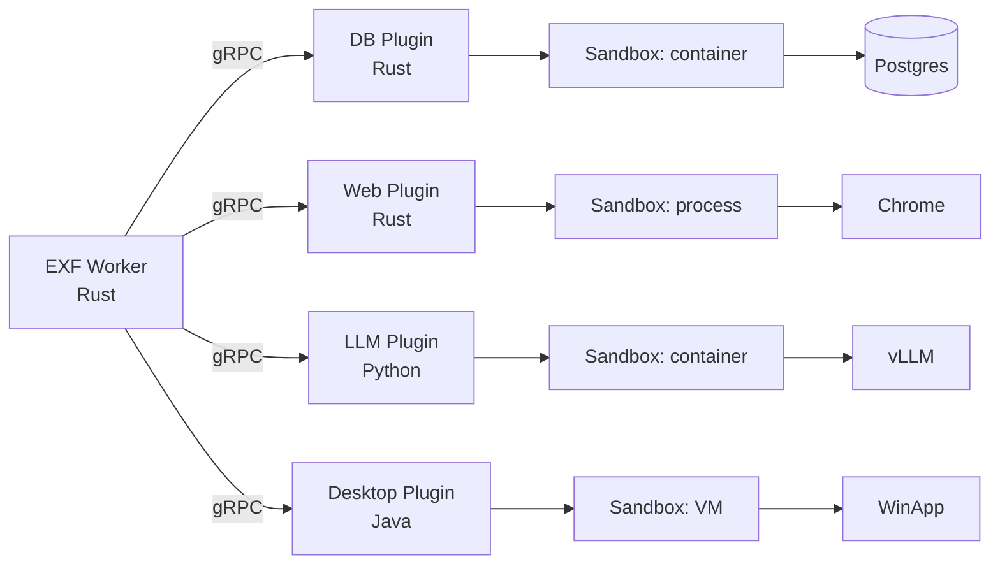
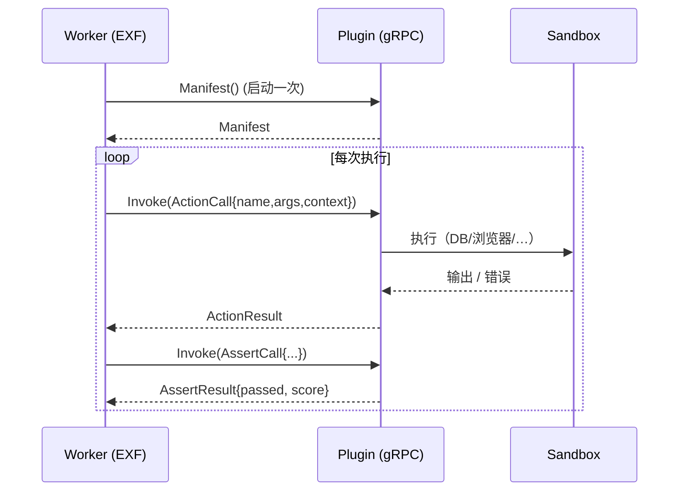
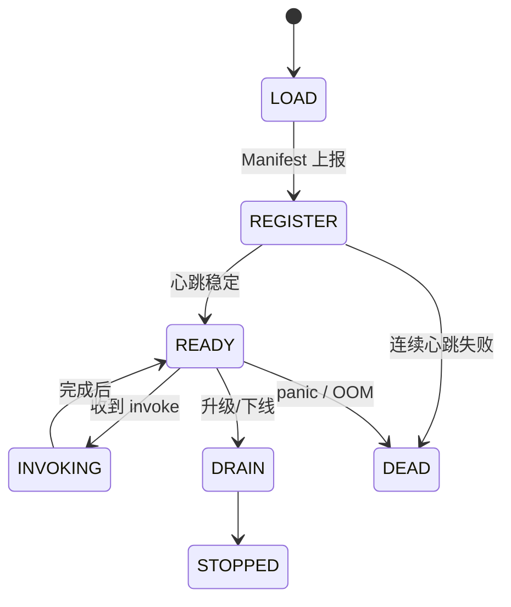
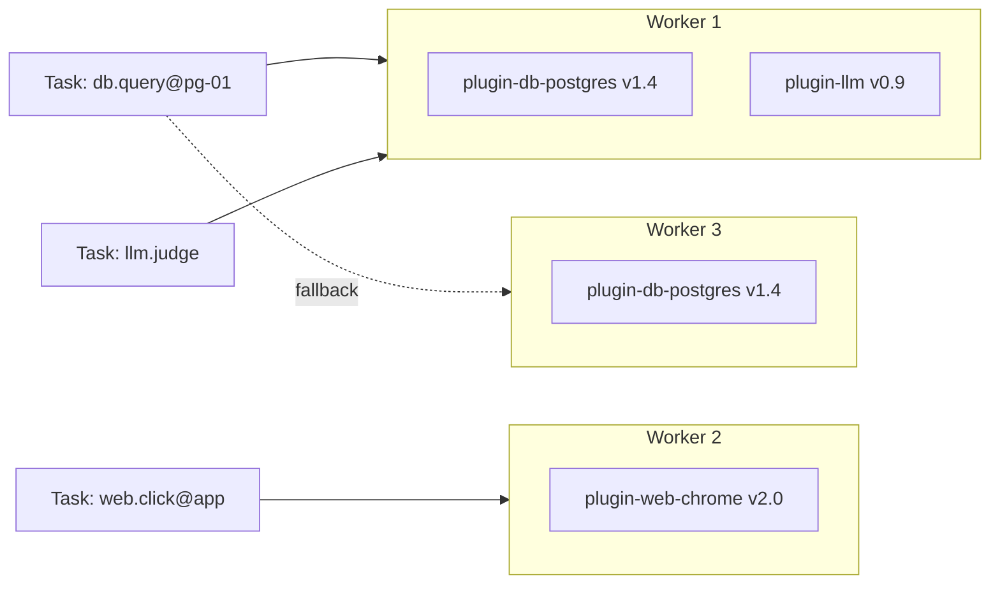
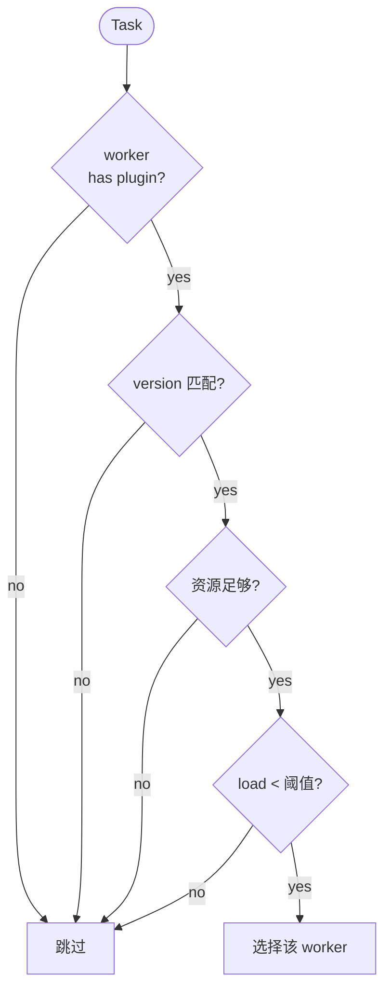
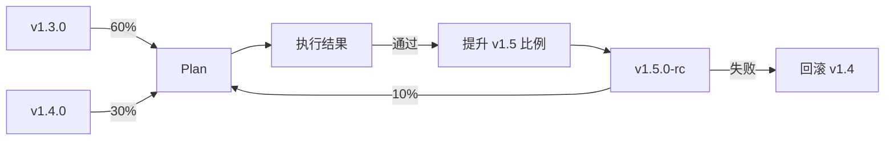

# 插件系统设计文档（PLG）

> 范围：定义 **业务能力的扩展点**，让任何场景（DB / Web / Desktop / Mobile / LLM / Cloud）  
> 都能以独立、低耦合、可灰度的方式接入执行框架。  
> 关联：[`architecture.md`](architecture.md) · [`requirements.md`](requirements.md) · [`test-case-management-design.md`](test-case-management-design.md) · [`execution-framework-design.md`](execution-framework-design.md)

---

## 1. 定位与边界

### 1.1 核心定位
- **内核完全不知道插件在做什么**。Worker 只通过 gRPC 调用 `Action / Assert`。
- 插件 = 一组 **target 类型 + actions + asserts + sandbox** 的集合。
- 任何语言可实现：Go / Rust / Python / Java / Node。

### 1.2 不做
- 不解释用例业务 —— 用例层只描述“做什么”，插件负责“怎么做”。
- 不存储数据 —— 状态归 EXF / TCM。
- 不直接调用目标 —— 全部经 Sandbox。

## 2. 设计原则

| # | 原则 | 落地 |
| --- | --- | --- |
| 1 | 协议即接口 | gRPC + Protobuf，禁任何语言专属 API |
| 2 | 沙箱即隔离 | 每个插件独立 sandbox、凭据、网络 |
| 3 | 能力即声明 | `Manifest` 静态描述，避免反射 |
| 4 | 多版本共存 | 同插件可 N 版本并行，灰度路由 |
| 5 | 失败即隔离 | 插件崩溃不影响 EXF 主循环 |
| 6 | SDK 多语言 | 官方 Go/Rust/Python/Java，降低门槛 |

## 3. 总体架构




```text
┌─────────────────────────────────────────────┐
│  Execution Framework  (EXF, Rust)            │
│  Worker ── gRPC client ──> Plugin Server     │
└────────────────────┬─────────────────────────┘
                     │ gRPC (Protobuf)
        ┌────────────┼─────────────┬──────────┐
        ▼            ▼             ▼          ▼
  ┌──────────┐ ┌──────────┐ ┌──────────┐ ┌──────────┐
  │ DB Plugin│ │Web Plugin│ │Desktop   │ │ LLM      │
  │  (Rust)  │ │  (Rust)  │ │ Plugin   │ │ Plugin   │
  │          │ │          │ │ (Java)   │ │ (Python) │
  │ ┌──────┐ │ │ ┌──────┐ │ │ ┌──────┐ │ │ ┌──────┐ │
│ │ │Sand- │ │ │ │Sand- │ │ │ │Sand- │ │ │ │Sand- │ │
│ │ │ box  │ │ │ │ box  │ │ │ │ box  │ │ │ │ box  │ │
│ │ └──────┘ │ │ └──────┘ │ │ └──────┘ │ │ └──────┘ │
│ └────┬─────┘ └────┬─────┘ └────┬─────┘ └────┬─────┘
└───────┼────────────┼────────────┼────────────┼───────┘
        ▼            ▼             ▼            ▼
    Postgres       Chrome       WinAppDriver  OpenAI
                                                  / vLLM
```

## 4. 插件协议

#### gRPC Invoke 时序




### 4.1 Manifest

```yaml
api_version: plugin.aitest/v1
name: plugin-db-postgres
version: 1.4.2
display: PostgreSQL Database
description: |
  Connect to Postgres, run SQL, verify schema, and migrations.
authors: [aitest-team]
license: Apache-2.0
homepage: https://github.com/aitest/plugin-db-postgres

sandbox:
  image: aitest/plugin-db-postgres:1.4.2
  cpu: "1"
  memory: "1Gi"
  network: { outbound: ["postgres:5432"] }
  disk: "2Gi"
  capabilities: [net_bind_service?]

secrets:
  - name: PGPASSWORD
    required: true
    from: secret://postgres/{target.id}/password
  - name: PGSSLROOTCERT
    required: false
    from: secret://postgres/{target.id}/ca

targets:
  types: [postgres]
  schema:
    type: object
    required: [host, database, user]
    properties:
      host:     { type: string }
      port:     { type: integer, default: 5432 }
      database: { type: string }
      user:     { type: string }
      ssl:      { type: boolean, default: true }
      pool:     { type: object, properties: { max: { type: integer, default: 8 } } }

actions:
  - name: db.query
    args:
      type: object
      required: [sql]
      properties:
        sql:      { type: string }
        params:   { type: array }
        timeout:  { type: integer, default: 30 }
    output:
      type: object
      properties:
        rows:     { type: array }
        affected: { type: integer }
        columns:  { type: array }
    timeout_ms: { default: 30000, max: 600000 }
  - name: db.migrate
    args: { type: object, required: [dir] }
  - name: db.snapshot
    args: { type: object, properties: { name: { type: string } } }

asserts:
  - name: db.row_count
    args: { type: object, required: [expect] }
  - name: db.column_value
    args:
      type: object
      required: [table, column, row, expect]
  - name: db.schema_equals
    args: { type: object, required: [expect] }
  - name: db.query_result
    args: { type: object, required: [sql, expect] }

errors:
  codes: [TARGET_UNREACHABLE, AUTH_FAIL, SQL_FAIL, TRANSACTION_FAIL, SCHEMA_MISMATCH]
```

### 4.2 Protobuf 定义

```proto
syntax = "proto3";
package aitest.plugin.v1;

import "google/protobuf/struct.proto";

service Plugin {
  // 注册时调用，回报能力
  rpc Manifest(google.protobuf.Empty) returns (Manifest);

  // 复用同一 stream，可并发 invoke
  rpc Invoke(stream InvokeRequest) returns (stream InvokeResponse);

  // 心跳
  rpc Heartbeat(google.protobuf.Empty) returns (HeartbeatResponse);
}

message Manifest {
  string name = 1;
  string version = 2;
  string api_version = 3;
  repeated Action actions = 4;
  repeated Assert asserts = 5;
  repeated string target_types = 6;
  Sandbox sandbox = 7;
  repeated Secret secrets = 8;
  repeated string error_codes = 9;
}

message Action { string name = 1; google.protobuf.Struct args_schema = 2; google.protobuf.Struct output_schema = 3; int32 timeout_default_ms = 4; int32 timeout_max_ms = 5; }
message Assert { string name = 1; google.protobuf.Struct args_schema = 2; }
message Sandbox { string image = 1; string cpu = 2; string memory = 3; repeated string network_outbound = 4; string disk = 5; }
message Secret { string name = 1; bool required = 2; string from = 3; }

message InvokeRequest {
  oneof body {
    ActionCall action = 1;
    AssertCall assert = 2;
  }
}
message ActionCall {
  string name = 1;
  google.protobuf.Struct args = 2;
  Context context = 3;
}
message AssertCall {
  string name = 1;
  google.protobuf.Struct args = 2;
  Context context = 3;
  // 上一 action 输出，断言可以基于此
  google.protobuf.Struct last_action_output = 4;
}
message Context {
  string task_id = 1;
  string case_id = 2;
  int32  case_version = 3;
  string target_id = 4;
  map<string,string> secrets = 5;     // 已注入的 secret 明文，仅本次会话
  string trace_id = 6;
  int64  deadline_ms = 7;
}

message InvokeResponse {
  oneof body {
    ActionResult action = 1;
    AssertResult assert = 2;
  }
}
message ActionResult {
  google.protobuf.Struct output = 1;
  repeated Artifact artifacts = 2;
  map<string,string> meta = 3;
  string error_code = 4;        // 失败时
  string error_message = 5;     // 失败时
  bool   retryable = 6;
}
message AssertResult {
  bool passed = 1;
  string error_code = 2;
  string error_message = 3;
  double score = 4;            // 软断言可返回分
  map<string,string> meta = 5;
}
message Artifact {
  string kind = 1;             // log|screenshot|video|file|matrix
  string uri = 2;              // s3:// or file://
  string sha256 = 3;
  int64  size = 4;
  google.protobuf.Struct meta = 5;
}
message HeartbeatResponse { int64 server_time_ms = 1; }
```

## 5. 进程模型

### 5.1 三种部署形态

| 形态 | 场景 | 启动 | 性能 |
| --- | --- | --- | --- |
| **In-process** | Python/Node 轻量插件 | 随 Worker 启动 | 高（无 IPC） |
| **Sidecar** | 通用 Go/Rust 插件 | 与 Worker 同 Pod | 高（localhost） |
| **Remote** | 重资源（Chrome/Desktop） | 独立节点/VM | 灵活 |

> v1.0 推荐 **Sidecar**（K8s Pod 内 sidecar 模式），简单且隔离足够。  
> 重资源走 **Remote**（如 Chrome 单独节点池）。

### 5.2 Sidecar 部署

```text
Pod
 ├── exf-worker (Rust)
 └── plugin-db-postgres (sidecar, image=aitest/plugin-db-postgres:1.4.2)
       port: 50051
       liveness: /healthz
```

EXF 在同 Pod 走 `localhost:50051` gRPC。

## 6. Sandbox

### 6.1 沙箱类型

| 类型 | 适用 | 隔离 | 启动开销 |
| --- | --- | --- | --- |
| 进程级 | Python / Node 插件 | seccomp / landlock | < 50 ms |
| 容器级 | 默认 | Docker / Podman | < 500 ms |
| VM 级 | 高安全（DB 生产、浏览器） | Firecracker / gVisor | < 1 s |

### 6.2 通用规则
- 默认 deny network；按 `target.network_outbound` 白名单。
- 凭据：插件启动时由 EXF 注入 env 或 tmpfs mount，沙箱结束立即销毁。
- 资源硬上限（cpu/mem/disk/pids）。
- 写盘走 **overlay**（`overlayfs`），结束回收。
- 不允许插件访问宿主机 `/proc /sys`，仅暴露受控子集。

### 6.3 Secret 注入
```text
EXF 启动沙箱
  │
  ▼
1. 查 Secret Store（OIDC/Vault）
2. mount 到沙箱 env / tmpfs
3. 启动插件
4. gRPC 调用时，EXF 把 secrets 作为 `Context.secrets` 传入
5. 沙箱结束 → umount / 销毁 env
```

## 7. 生命周期




```text
load ──▶ register (Manifest → EXF) ──▶ heartbeat 5s ──▶ ready
                                                │
                                                ▼
                                      dispatch (按 capability)
                                                │
                                                ▼
                                      invoke (gRPC, timeout)
                                                │
                                                ▼
                                       idle (保留在池)
                              升级：hot reload
                              退出：graceful shutdown 30s
```

- **热更新**：EXF 收到新 Manifest 拉取通知 → 启动新版本 sidecar → 灰度切流 → 旧版本 graceful shutdown。
- **降级**：插件不可用 → EXF 把它排除，调度器自动回退次优插件（如果用例声明多插件 fallback）。

## 8. 能力发现

#### 能力矩阵（逻辑视图）



#### 调度匹配流程




EXF 维护 **能力矩阵**：

```text
(plugin_name, plugin_version, target_type) → { worker_id, capabilities, load, last_heartbeat }
```

Worker 启动时注册：

```text
worker.register({
  worker_id, cpu, mem, gpu, network,
  plugins: [
    { name: "plugin-db-postgres", versions: ["1.4.x"], target_types: ["postgres"] },
    { name: "plugin-web-chrome",  versions: ["2.x"],   target_types: ["web"] }
  ]
})
```

调度算法：

```text
for task in queue:
  for worker in workers:
    if worker.has(task.plugin, task.plugin_version, task.target.type)
       and worker.resources >= task.requirements
       and worker.load < backpressure
       and task not in worker.recent_failures:
        return worker
  fallback to secondary plugin (if case declared)
```

## 9. 错误码与可重试性

| 错误码 | 含义 | 可重试 | 处理 |
| --- | --- | --- | --- |
| `TARGET_UNREACHABLE` | 网络/DNS/连接 | ✅ | 退避重试 |
| `AUTH_FAIL` | 凭据错 | ❌ | 立即失败 + 告警 |
| `TIMEOUT` | 超时 | ✅ | 退避重试 |
| `ASSERTION_FAIL` | 业务断言失败 | ❌ | 计入失败 |
| `SCHEMA_VIOLATION` | 参数错误 | ❌ | 立即失败 |
| `INTERNAL` | 插件自身 bug | ❌ | 计入 plugin_error，告警 |
| `RESOURCE_EXHAUSTED` | 沙箱资源 | ✅ | 退避重试 |
| `CANCELED` | 主动取消 | ❌ | 计入取消 |

插件应在 ActionResult/AssertResult 中显式给出 `retryable` 和 `error_code`，EXF 据此决策。

## 10. 多语言 SDK

### 10.1 Go

```go
type Plugin interface {
    Manifest() *Manifest
    Action(ctx context.Context, name string, args json.RawMessage, c *Context) (json.RawMessage, error)
    Assert(ctx context.Context, name string, args json.RawMessage, c *Context, last json.RawMessage) (AssertResult, error)
}
```

`aitest/plugin-go` 提供 `Serve()` 启动 gRPC server。

### 10.2 Rust

```rust
#[aitest_plugin(name = "plugin-db-postgres", version = "1.4.2")]
pub struct PgPlugin;

#[action]
async fn db_query(args: QueryArgs, ctx: Context) -> Result<QueryOutput, Error> { ... }

#[assert]
async fn row_count(args: RowCountArgs, ctx: Context) -> AssertResult { ... }

aitest_plugin_serve!(PgPlugin);
```

`aitest-plugin` crate 提供 `#[aitest_plugin]` / `#[action]` / `#[assert]` 宏。

### 10.3 Python

```python
from aitest_sdk import Plugin, action, assert_, Serve

class MyPlugin(Plugin):
    name = "plugin-shell"

    @action("shell.run")
    def run(self, args, ctx):
        return {"stdout": ..., "stderr": ..., "rc": ...}

    @assert_("shell.contains")
    def contains(self, args, ctx, last):
        return {"passed": args["substr"] in last["stdout"]}

Serve(MyPlugin()).start()  # 默认监听 0.0.0.0:50051
```

### 10.4 Java

```java
@AitestPlugin(name = "plugin-mobile-android", version = "0.1.0")
public class AndroidPlugin implements Plugin {
    @Action("mobile.tap")
    public JsonNode tap(JsonNode args, Context ctx) { ... }
}
```

## 11. 内置插件目录（v1.0）

| 插件 | 实现 | 能力 |
| --- | --- | --- |
| `plugin-shell` | Rust | shell / file / process |
| `plugin-http` | Rust | HTTP / 契约 / mock |
| `plugin-python` | Python | 受限 Python 解释器 |
| `plugin-db-postgres` | Rust | SQL、Schema、迁移、COPY |
| `plugin-db-mysql` | Rust | SQL、Schema、迁移 |
| `plugin-db-mongo` | Rust | CRUD、聚合、索引 |
| `plugin-web-chrome` | Rust | Chrome DevTools Protocol |
| `plugin-web-firefox` | Rust | geckodriver |
| `plugin-desktop-win` | Java/C# | WinAppDriver / FlaUI |
| `plugin-mobile-android` | Java | Appium |
| `plugin-mobile-ios` | Java/Swift | Appium / XCUITest |
| `plugin-llm` | Python | OpenAI / vLLM / 本地模型 |
| `plugin-llm-judge` | Python | LLM 评审、嵌入 |
| `plugin-cloud-k8s` | Go | K8s 资源 |
| `plugin-cloud-aws` | Go | AWS SDK |
| `plugin-chaos` | Go | chaos-mesh |
| `plugin-golden` | Rust | 黄金样本对比 |
| `plugin-property` | Rust | Property-based |

每个插件都是独立仓库，CI 发布镜像 + 签名。

## 12. 场景示例

### 12.1 数据库插件

```yaml
target: pg-staging-01
actions:
  - db.query: { sql: "select count(*) from users" }
asserts:
  - db.row_count: { expect: ">0" }
  - db.query_result: { sql: "select version()", expect: "PostgreSQL 1[5-7]" }
```

### 12.2 Web 插件

```yaml
target: chrome-pool
actions:
  - web.open:   { url: "https://app.example.com" }
  - web.fill:   { selector: "#user", value: "alice" }
  - web.click:  { selector: "#submit" }
  - web.wait:   { selector: ".dashboard", until: visible, timeout_ms: 5000 }
asserts:
  - web.url_match:    { pattern: ".*/dashboard" }
  - web.contains:     { selector: "h1", text: "Welcome" }
artifacts:
  - kind: screenshot  # 自动收集
```

### 12.3 LLM 插件

```yaml
target: openai-prod
actions:
  - llm.complete: { model: gpt-4o, prompt: "...", temperature: 0 }
asserts:
  - llm_judge:    { rubric: "...", threshold: 0.8 }
  - json_schema:  { schema: { type: object, required: [summary] } }
```

### 12.4 桌面插件

```yaml
target: windows-vm-01
actions:
  - desktop.open_app:    { path: "C:/app/calc.exe" }
  - desktop.click:       { selector: "name=2" }
  - desktop.click:       { selector: "name=+" }
  - desktop.click:       { selector: "name=3" }
  - desktop.screenshot:  { path: "calc.png" }
asserts:
  - image_match:         { baseline: "calc_expected.png", threshold: 0.95 }
```

## 13. 安全

- **镜像签名**：插件镜像必须带 cosign 签名，EXF 启动时校验。
- **Manifest 签名**：通过 Sigstore 验证来源。
- **Secret 隔离**：插件无法持久化 secret；EXF 每次调用注入。
- **网络隔离**：默认 deny；按 target 白名单。
- **资源配额**：每插件 / 每 worker 都有硬上限。
- **审计**：所有 invoke 走 trace_id，落 OTel + audit log。

## 14. 性能

- 进程内 gRPC 连接池（`hyper` / `tonic` channel pool）。
- 同一 `(plugin, target)` 复用连接；LRU 关闭空闲。
- 零拷贝 Protobuf（`rkyv` / `bytes`）。
- Plugin 端协程：每连接 N worker 协程，backpressure 限流。
- 关键插件（DB/HTTP）用 Rust 实现，性能与 EXF 对齐。

## 15. 灰度与版本兼容




- **Manifest 版本**：`api_version: plugin.aitest/v1`，EXF 拒绝不兼容版本。
- **插件版本**：`version: 1.4.2`（SemVer）。
- **多版本并存**：Worker 可同时装载 v1.3 和 v1.4。
- **灰度**：Plan 指定 `plugins: [{name, version_range}]`，调度按比例切流。
- **回滚**：版本回退 = 调低灰度比例 = 0。

## 16. 失败隔离

- 插件 panic → EXF 关闭连接，标记 worker plugin_health=bad，30 s 后重新尝试。
- 插件 OOM → 沙箱 OOM kill，记 metric，告警。
- 插件慢调用 → EXF 端超时熔断。
- 插件无响应 → 走 gRPC deadline，kill 沙箱。

## 17. 部署

```mermaid
flowchart TB
  subgraph Pod1[Pod A]
    W1[exf-worker]
    S1[plugin-db-postgres sidecar]
  end
  subgraph Pod2[Pod B]
    W2[exf-worker]
    S2[plugin-web-chrome sidecar]
  end
  subgraph Pod3[Pod C (remote)]
    S3[plugin-desktop-win]
  end
  W1 -->|localhost:50051| S1
  W2 -->|localhost:50051| S2
  W1 -. gRPC over network .-> S3
```


- **Sidecar**：K8s Pod 内 `plugin-*` container，与 `exf-worker` 同生命周期。
- **Remote**：插件独立 Deployment / DaemonSet，EXF 通过 Service DNS 连接。
- **镜像仓库**：插件镜像走内部 Harbor。
- **签名**：cosign keyless（OIDC）。

## 18. 验收

- AC-1：第三方开发者根据 SDK 在 1 天内写出可用插件。
- AC-2：内置 11 类插件可被加载、调用、卸载。
- AC-3：插件 panic 不影响 EXF 主循环。
- AC-4：插件镜像签名缺失时 EXF 拒绝启动。
- AC-5：多版本插件可灰度（10% / 50% / 100%）。
- AC-6：插件 invoke 链路 P95 < 50 ms（本地 sidecar）。
- AC-7：插件支持热更新，零停机。

