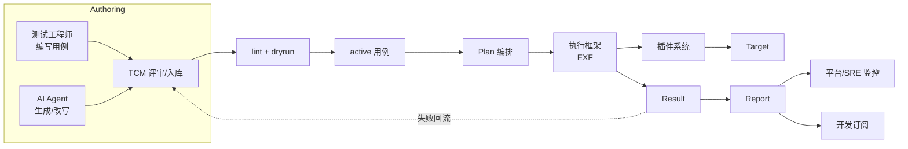

# 需求文档 — AI 时代测试框架与用例管理

> 版本：v2.0（彻底重构版）  
> 范围：覆盖 **海量用例管理** 与 **高并发执行框架** 两大子系统的端到端需求。  
> 关联文档：[`architecture.md`](architecture.md) · 上一版：[`design.md`](design.md)  
> 分模块设计：[`test-case-management-design.md`](test-case-management-design.md) · [`execution-framework-design.md`](execution-framework-design.md) · [`plugin-system-design.md`](plugin-system-design.md)

---

## 1. 项目背景与愿景

### 1.1 现状与痛点

- **用例规模爆炸**：随业务 + AI 自动生成，测试用例从「万级」向「百万~亿级」跃迁，传统“目录 + YAML 文件”管理模式在 **检索、复用、变更追踪、权限** 上失效。
- **执行资源异构**：同样的“一条用例”可能跑在本地进程、K8s Pod、远端 Windows 桌面、浏览器集群、移动设备、LLM 网关 —— 现有框架只能绑定一种执行方式。
- **AI 时代新需求**：
  - 用例需可被 **LLM 读写、检索、改写、合成**（不仅是人类作者）。
  - 失败样本需 **自动回流** 为新用例，形成「执行 → 数据 → 新用例」闭环。
  - 验证手段从「contains/rc」扩展为 **结构 / 行为 / 语义 / 属性 / 评审** 多维判定。
- **效率瓶颈**：现有调度器是单机同步或线程池，无法应对「千级并发 + 长尾用例 + 资源隔离」的真实生产环境。

### 1.2 愿景

> **一套可承载百万级用例、万级并发、按场景无限扩展的 AI 时代测试基础设施。**
> 核心：把「**管理**」和「**执行**」彻底解耦 —— 用例管理只关心“数据”，执行框架只关心“调度”，
> 真正的业务动作全部下放到 **插件（Plugin）** 中。

### 1.3 目标用户

| 角色 | 关注点 |
| --- | --- |
| 测试架构师 | 设计用例模型、定义插件协议、治理资产 |
| 测试工程师 | 编写 / 评审 / 维护用例、查看报告 |
| 平台 / SRE | 部署执行集群、扩缩容、监控 |
| AI / Agent | 自动生成 / 改写 / 检索用例，作为工具使用 |
| 开发 | 接入 CI、跑回归 |

#### 用户旅程图

---

## 2. 业务场景

| 场景 | 描述 | 关键诉求 |
| --- | --- | --- |
| **数据库回归** | 数千张表、迁移、SQL 正确性 | DB 插件、长事务、并发跑 |
| **Web / API 自动化** | 浏览器、E2E、契约测试 | Web 插件、浏览器池、跨域 |
| **桌面应用** | Windows / macOS 原生应用 | 桌面插件、UI 自动化 |
| **移动端** | Android / iOS 真机或模拟器 | Mobile 插件、设备农场 |
| **AI 模型 / Agent** | LLM 输出、Agent 工具调用、推理 | LLM 插件、裁判、Replay |
| **云原生** | K8s、Service Mesh、Serverless | Cloud 插件、声明式、混沌 |
| **性能 / 容量** | 压测、稳定性、限流 | 性能插件、流量生成、指标 |

每个场景对应一个或多个 **插件**。框架本身不实现任何场景。

---

## 3. 范围与边界

### 3.1 范围内

1. **用例管理子系统**：建模、存储、检索、版本、关系、生命周期、权限、审计。
2. **执行框架子系统**：极简调度内核 + 高性能执行集群，覆盖计划编译、DAG、队列、并发分发、状态机、结果回收、重试、超时、沙箱。
3. **插件系统**：插件协议、生命周期、注册与发现、能力声明。
4. **可观测**：执行报告、指标、Trace、告警。
5. **AI 协作**：LLM 作为评审 / 生成器 / 检索器。

### 3.2 范围外（v1.0）

- 测试用例 IDE（GUI 编辑器）
- 测试需求 / 缺陷管理（与 Jira / Polarion 对接是后续工作）
- 全自动探索式测试
- 性能压测流量生成细节（仅提供接入点）

---

## 4. 功能需求（FR）

### 4.1 用例管理（Test Case Management, TCM）

#### FR-TCM-1 用例模型
- 必须用 **结构化数据** 表达（YAML/JSON/SQL 行均可），禁止将逻辑写死在代码里。
- 必填字段：`id / name / version / owner / source / tags / target / actions / asserts / created_at / updated_at`。
- 扩展字段：以 `x-*` 前缀自定义，不被框架语义理解。

#### FR-TCM-2 海量存储
- 至少支持 **1 亿条用例** 的存储、查询。
- 单条用例体积 ≤ 16 KB（典型 1~4 KB）。
- 存储后端：**PostgreSQL（JSONB）为主，文件系统为辅（Git/对象存储）**。
- 用例必须可序列化为稳定的 JSON（key 顺序、版本号），便于 LLM 处理和 git diff。

#### FR-TCM-3 检索
- 标签精确 / 包含 / 排除（`tags: [+smoke, -flaky]`）。
- 全文检索（标题、描述、步骤）。
- **语义检索**：基于 embedding（向量化）找“相似用例”，用于 LLM 上下文。
- 字段过滤：owner / source / plugin / severity / created_at 区间。
- **复合表达式**：`plugin=db AND (severity in [P0,P1]) AND NOT tag=deprecated`。

#### FR-TCM-4 版本与变更
- 每条用例有不可变的 `version`（单调递增）。
- 任何字段变更产生新版本，旧版本保留（用于回溯 / Replay）。
- 每次变更写入 **审计日志**（who/when/what/why）。
- 支持**蓝绿 / 金丝雀**：把一批新版本用例按比例下发。

#### FR-TCM-5 关系
- `depends_on` / `blocks` / `related_to` / `cloned_from`。
- 关系参与调度（依赖未通过则不跑 / 标记 blocked）。

#### FR-TCM-6 生命周期
- `draft → active → deprecated → archived`。
- 仅 `active` 的用例默认参与执行。
- 归档不删除，便于回放与合规。

#### FR-TCM-7 集合（Suite / Plan / Campaign）
- **Suite**：无状态用例集合，YAML 引用。
- **Plan**：执行计划（选哪些用例、并发、优先级、超时），可定时。
- **Campaign**：跨 Plan 的活动（如“618 大促回归”），聚合统计。

#### FR-TCM-8 权限
- RBAC：`owner / editor / runner / viewer`。
- 团队（Team）维度隔离。
- 审计：所有变更、查询、导出可追溯。

#### FR-TCM-9 导入 / 导出 / 同步
- 批量导入：YAML / JSON / CSV / Excel / `pytest` collection。
- 导出：按查询条件导出 YAML / JSON / JUnit。
- **与 Git 双向同步**：用例目录可挂在 Git，commit 触发更新。

#### FR-TCM-10 Diff
- 用例间 diff（同一 id 不同版本 / 不同 id 之间）。
- 集合间 diff（Plan A vs Plan B）。
- 变更集（PR 视图）。

#### FR-TCM-11 元数据 / 来源
- `source`: `human / ai-generated / auto-mined / replay`。
- AI 生成的用例带 `generator: { model, prompt_hash, parent_id }`。
- Replay 样本带 `replay_of: case_id@version`。

### 4.2 执行框架（Execution Framework, EXF）

#### FR-EXF-1 极小内核
- 内核只做：**取任务 → 找插件 → 派发 → 等结果 → 回收 / 重试**。
- 不解释任何业务动作；不 import 任何场景 SDK。
- 内核代码量目标 < 3000 行。

#### FR-EXF-2 并发执行
- 支持 **进程级 / 线程级 / 协程级** 三种 worker。
- 单 Plan 可达 **10K+ 并发**。
- 支持 **抢占**（priority）与 **公平队列**（FIFO）。
- **限流**：按插件、按 target、按租户设置 QPS / 并发上限。

#### FR-EXF-3 分布式
- Master / Worker 架构，水平扩展 Worker。
- 支持多种 broker：内存（开发）、Redis / NATS / RabbitMQ / Kafka（生产）。
- 任务可粘性：同一用例的多次重试尽量路由到同一 worker（缓存命中）。
- 状态机持久化在共享存储；Worker 崩溃可被接管。

#### FR-EXF-4 沙箱与隔离
- 每条用例运行在 **独立沙箱**：
  - 进程级：`subprocess` + 资源限制（rlimit / cgroup）。
  - 容器级：Docker / Podman。
  - VM 级：Firecracker（高安全场景）。
- 沙箱内可访问的 target 由插件声明（凭据自动注入）。
- 用例结束沙箱立刻回收。

#### FR-EXF-5 失败策略
- 重试：指数退避、最大次数、可配置“仅对瞬时错误重试”。
- 隔离：失败 N 次自动降级 / 隔离该 worker 上后续任务。
- 熔断：target 失败率超阈值 → 整体暂停 → 告警。

#### FR-EXF-6 超时 / 取消
- 每条用例可设 `timeout`，全局 Plan 也可设。
- 支持**主动取消**（用户中断、依赖失败）。
- Worker 端硬超时（不会“跑死”）。

#### FR-EXF-7 资源感知调度
- Worker 容量声明（CPU / memory / GPU / 网络）。
- 任务带 `requirements`，调度器做 **bin-packing**。
- 支持亲和 / 反亲和（如不要把同 DB 的用例集中到一个 worker）。

#### FR-EXF-8 结果与回放
- 结果标准化：`{ case_id, version, plugin, target, status, started, finished, duration, error, artifacts, trace_id }`。
- `artifacts` 通用协议：日志、截图、录像、文件、向量。
- **Replayer**：用同一 target / 同一插件复现历史用例。

#### FR-EXF-9 与 CI 集成
- 监听 Git push / MR / 定时事件。
- 触发 Plan。
- 输出 JUnit / GitLab / GitHub / Allure / 自定义报告。

### 4.3 插件系统（Plugin System, PLG）

#### FR-PLG-1 插件协议
- 一份 **插件清单**（manifest）声明：
  - `name`、`version`、`api_version`
  - 支持的 `target` 类型（如 `postgres`, `chrome`, `windows-desktop`）
  - 提供的 `actions`（如 `db.query`, `web.click`）
  - 提供的 `asserts`（如 `db.row_count`, `web.url_match`）
  - `sandbox`: 镜像、依赖、权限
  - `secrets`: 所需凭据 schema
- 插件用 **宿主语言无关** 的协议（建议 gRPC + JSON Schema / Protobuf）暴露能力。

#### FR-PLG-2 插件生命周期
- 加载、注册、心跳、热更新、卸载。
- 插件独立升级不影响内核。
- 同一插件多版本可共存（灰度）。

#### FR-PLG-3 内置插件（v1.0）
| 插件 | 能力 |
| --- | --- |
| `plugin-shell` | shell / 文件 / 进程 |
| `plugin-http` | HTTP / 契约 / mock |
| `plugin-python` | 嵌入 Python 解释器（受限） |
| `plugin-db-postgres` | 连接、SQL、Schema、迁移 |
| `plugin-web-chrome` | Chrome 浏览器自动化 |
| `plugin-desktop-win` | Windows 桌面 UI |
| `plugin-mobile-android` | Android 设备 |
| `plugin-llm` | LLM 调用、嵌入、评判 |
| `plugin-cloud-k8s` | K8s 资源操作 |

#### FR-PLG-4 第三方插件开发
- 提供 SDK：Go / Python / Java 任一。
- 插件仓库（Plugin Hub）允许社区发布。
- 签名 / 来源校验，避免供应链风险。

#### FR-PLG-5 能力发现
- Worker 启动时向 Master 报告自己装载的插件与目标。
- 调度器按「目标 + 插件 + 能力」三元组匹配。
- 目标不可达时自动回退到次优 worker。

### 4.4 AI 协作（AI Collaboration, AIC）

#### FR-AIC-1 用例生成
- 输入：目标代码 / 接口契约 / 失败回放。
- 输出：结构化用例（与 `Case` schema 严格一致）。
- 必经环节：`aitest lint` + dry-run，否则拒绝入库。

#### FR-AIC-2 用例改写 / 自愈
- UI / 接口变化时，根据历史用例与差异自动改写。
- 改写前后必须有 **diff 评审**（人 / 另一 LLM）。

#### FR-AIC-3 评审 / 评判
- 用 `llm_judge` 作为 assertor，输出 `score + reason`。
- 评分可作为软门禁（不通过则告警，不一定阻塞）。

#### FR-AIC-4 检索
- 用例库提供 MCP / OpenAPI，LLM 可作为客户端查询、推荐、引用。

### 4.5 可观测（Observability, OBS）

- 指标：执行数、通过率、P50/P95 用时、按插件 / target 维度。
- Trace：OpenTelemetry，跨 Master / Worker / Plugin。
- 日志：结构化、可检索。
- 报告：JUnit / Allure / HTML / Slack 摘要。

---

## 5. 非功能需求（NFR）

| 类别 | 指标 |
| --- | --- |
| **用例管理 QPS** | 写入 1K QPS、查询 10K QPS、语义检索 100 QPS |
| **执行并发** | 单集群 ≥ 10K 并发用例；单 Plan 可跨 1K worker；支持 100K+ 待执行队列 |
| **执行吞吐** | 持续 ≥ 5K 用例 / 分钟（短用例）；峰值 ≥ 10K 用例 / 分钟 |
| **延迟** | 调度 P95 ≤ 50 ms；用例分发 P95 ≤ 200 ms；单 Worker 拉取 P95 ≤ 50 ms |
| **可用性** | 99.9% SLA（Master 3 节点 / 多 AZ） |
| **扩展性** | 无状态 Worker 水平扩展；存储分库分表 |
| **安全** | 用例凭据密文存、运行期注入；沙箱默认 deny network |
| **可移植** | 部署：本地 / 容器 / K8s；OS：Linux / macOS / Windows |
| **可观测** | 指标、Trace、日志必须自带，无需外部依赖即可开箱 |
| **兼容** | 兼容 OneTear YAML 旧用例（迁移工具） |

---

## 6. 约束与假设

- **语言分层约束**：管理 / 执行 / 插件是三个独立模块。Python 只适合原型与插件 SDK；生产执行内核必须使用 Rust 或 Go 二选一，核心代码不得把业务逻辑与 Python 绑定。
- **协议约束**：模块之间只允许通过稳定协议通信（HTTP/gRPC + Protobuf），不共享进程内对象；Rust/Go 内核不得 import Python。
- 内核必须保持 < 3000 行 Rust 或 Go，便于审计、静态分析与高性能调度。
- 用例 ID 在全局唯一（`area.module.behavior` + hash 兜底）。
- 任何插件的“致命”错误不应拖垮 Master。
- 存储最终一致可接受（写后 1 s 内可查）。
- 不假设“用例 100% 正确”，框架需容忍坏数据并明确报错。

---

## 7. 风险与缓解

| 风险 | 缓解 |
| --- | --- |
| 插件失控（任意执行） | 沙箱 + 资源配额 + 凭据按需 + 审计 |
| 用例库被“投毒” | 所有权 + 评审流 + 签名 + 蓝绿发布 |
| LLM 生成的用例不可执行 | lint + dry-run 强制门禁 |
| 海量用例的存储成本 | 冷热分层：active 入 DB，archived 入对象存储 |
| Worker 不稳定 | 任务幂等 + 状态机持久化 + 心跳 + 重派 |
| 用例执行慢 | 优先级 + 抢占 + Worker 弹性扩容 + 短路断言 |

---

## 8. 验收标准（节选）

- AC-1：能在一个 Worker 上跑通 7 类内置插件的示例。
- AC-2：能在 3 节点集群上稳定跑 10K 并发用例，P95 分发 < 1 s。
- AC-3：管理 API 能在 1 亿用例下完成「标签 + 全文 + 语义」混合检索，P95 < 500 ms。
- AC-4：编写一个第三方插件 SDK 文档，外部开发者 1 天内可写出可用插件。
- AC-5：LLM 生成的用例通过 lint + dry-run 后可直接入库并被执行。
- AC-6：失败的用例能自动回放（replayer 用相同 target + 插件复现）。

