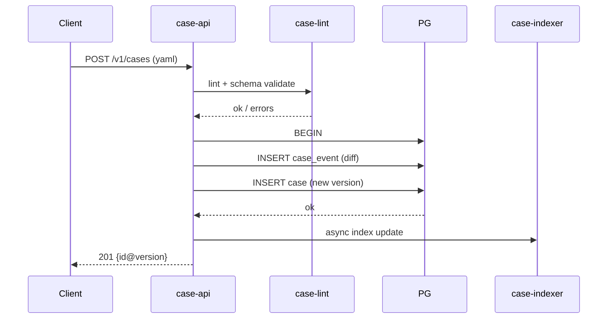
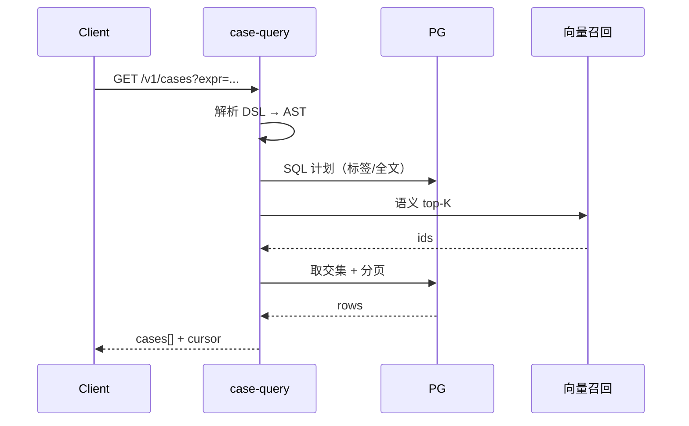
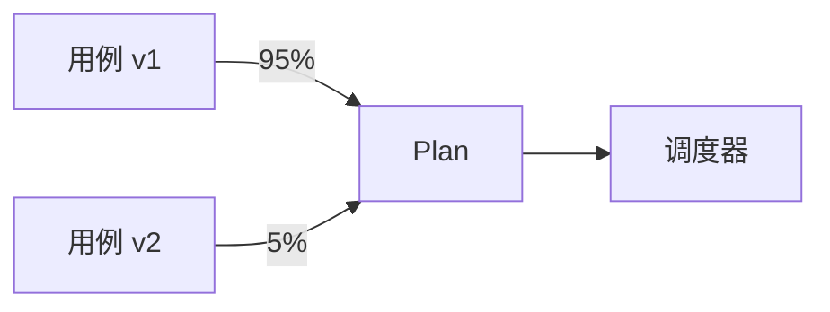

# 用例管理子系统设计文档（TCM）

> 范围：**用例** 的全生命周期管理 —— 模型、存储、检索、版本、权限、协作、扩展。  
> 关联：[`architecture.md`](architecture.md) · [`requirements.md`](requirements.md) · [`execution-framework-design.md`](execution-framework-design.md) · [`plugin-system-design.md`](plugin-system-design.md)

---

## 1. 目标与非目标

### 1.1 目标
- 承载 **1 亿级** 用例，单条 ≤ 16 KB，典型 1~4 KB。
- 查询 P95 ≤ 50 ms（标签/全文），P95 ≤ 200 ms（语义）。
- 用例是 **不可变 + 版本化** 的，任何变更产生新版本。
- LLM 可作为一等消费者（提供 MCP / OpenAPI）。
- 存储 / 索引 / 服务 **三者解耦**，可独立扩缩。

### 1.2 非目标
- 不负责“执行”任何用例 —— EXF 是消费者。
- 不承担缺陷 / 需求 / 项目管理（可后续通过集成层对接）。

## 2. 角色与用户旅程

| 角色 | 旅程 |
| --- | --- |
| 测试工程师 | 编写 → 评审 → 入库 → 灰度 → 查看执行结果 |
| 测试架构师 | 设计 Schema、维护插件/Target 字典、定义 RBAC |
| 平台 / SRE | 维护存储 / 索引、扩容、监控 |
| AI / Agent | 通过 MCP 检索 → 生成 → dryrun → 提议入库 |
| 开发 | 触发 Plan、订阅结果 |

## 3. 领域模型

#### ER 关系图

```mermaid
erDiagram
  CASE ||--o{ CASE_EVENT : produces
  CASE ||--o{ CASE_RELATION : "from"
  CASE ||--o{ CASE_RELATION : "to"
  CASE }o--|| TARGET : "uses"
  CASE ||--|{ ACTION : contains
  CASE ||--o{ ASSERT : contains
  PLAN ||--|{ CASE_REF : schedules
  SUITE ||--|{ CASE_REF : groups
  TARGET ||--o{ SECRET : "refs"
  CASE {
    text id PK
    int version PK
    text status
    text owner
    text source
    text[] tags
    text severity
    jsonb data
  }
  ACTION { text name; jsonb args }
  ASSERT { text name; jsonb args; bool soft }
  TARGET { text id PK; text plugin; jsonb endpoint }
  PLAN { text id PK; text name; int concurrency }
  CASE_RELATION { text from_id; text to_id; text type }
  CASE_EVENT { bigserial id PK; text case_id; int version; text type; jsonb diff }
```


```text
Case
├── id          : text        // 业务 ID，全局唯一
├── version     : int         // 单调递增
├── status      : enum        // draft|active|deprecated|archived
├── name        : text
├── description : text
├── owner       : ref(User|Team)
├── source      : enum        // human|ai-generated|auto-mined|replay
├── generator   : object?     // { model, prompt_hash, parent_id }
├── tags        : text[]
├── severity    : enum        // P0..P3
├── target      : ref(Target)
├── actions     : Action[]
├── asserts     : Assert[]
├── fixtures    : { setup[], teardown[] }
├── requirements: { cpu, mem, gpu, disk, net }
├── timeout_ms  : int
├── retries     : int
├── relations   : { type, to }[] // depends_on / blocks / related_to / cloned_from
├── audit       : object
├── created_at  / updated_at
└── x_*         : jsonb       // 扩展字段

Action  { name, args, x_* }
Assert  { name, args, soft, x_* }
Target  { id, plugin, endpoint, secrets[], labels, x_* }
Plan    { id, name, cases[], concurrency, priority, deadline, requirements, plugins[] }
Suite   { id, name, case_refs[] }   // 无状态引用集合
```

## 4. 存储设计

### 4.1 主存储：PostgreSQL

```sql
CREATE TABLE case (
  id          text,
  version     int,
  data        jsonb NOT NULL,                    -- 完整数据
  status      text NOT NULL,
  owner       text NOT NULL,
  source      text NOT NULL,
  tags        text[] NOT NULL DEFAULT '{}',
  severity    text NOT NULL DEFAULT 'P3',
  target_id   text,
  search_vec  tsvector GENERATED ALWAYS AS (
    setweight(to_tsvector('simple', coalesce(name,'')), 'A') ||
    setweight(to_tsvector('simple', coalesce(description,'')), 'B')
  ) STORED,
  embedding   vector(1024),                       -- pgvector
  created_at  timestamptz NOT NULL DEFAULT now(),
  updated_at  timestamptz NOT NULL DEFAULT now(),
  created_by  text NOT NULL,
  PRIMARY KEY (id, version)
);
CREATE INDEX case_id_latest    ON case (id, version DESC);
CREATE INDEX case_tags_gin     ON case USING gin (tags);
CREATE INDEX case_search_gin   ON case USING gin (search_vec);
CREATE INDEX case_target       ON case (target_id);
CREATE INDEX case_owner        ON case (owner);
CREATE INDEX case_embedding    ON case USING ivfflat (embedding vector_cosine_ops) WITH (lists = 100);
```

### 4.2 事件溯源

```sql
CREATE TABLE case_event (
  id          bigserial PRIMARY KEY,
  case_id     text,
  version     int,
  type        text,         -- create|update|deprecate|archive|restore|delete
  actor       text,
  payload     jsonb,        -- 完整新版本
  diff        jsonb,        -- 与上一版本的字段级 diff
  reason      text,
  created_at  timestamptz DEFAULT now()
);
```

- 所有写操作必须先写 `case_event`，再写 `case`。
- 支持回放：消费事件重建状态（用于审计、灾备、迁移）。
- **不可删**：保留 N 年，TTL 由分区表策略。

### 4.3 归档与冷热分层

- `active` / `deprecated` 在主库（PG）。
- `archived` 迁到 **对象存储**（S3 / MinIO）Parquet，PG 仅留 `id/version/pointer`。
- 读 archived → 后台异步拉取，UI 提示“归档态”。

### 4.4 关系表

```sql
CREATE TABLE case_relation (
  from_id  text, from_version int,
  type     text,                -- depends_on|blocks|related_to|cloned_from
  to_id    text, to_version   int,
  PRIMARY KEY (from_id, from_version, type, to_id, to_version)
);
```

## 5. 索引与检索

| 索引 | 实现 | 用于 |
| --- | --- | --- |
| 标签 | GIN(tags) | `tag=smoke`、`+smoke -flaky` |
| 全文 | tsvector + pg_trgm | 标题 / 描述 / 步骤 |
| 语义 | pgvector / 独立向量库 | “相似用例”、LLM 上下文 |
| 结构 | JSONB GIN | `actions[*].name = 'db.query'` |
| 元数据 | B-tree | owner / source / severity / 时间 |

**复合查询表达式**（DSL 简化）：

```text
plugin=db AND severity IN (P0,P1) AND tag!=deprecated
  AND updated_at >= now()-7d
  AND embedding <=> :vec < 0.2
```

`case-query` 解析为：
1. 标签/字段 → SQL
2. 全文 → SQL `@@`
3. 语义 → 向量召回 top-K → 与 SQL 结果求交

## 6. 服务划分

| 服务 | 职责 | 实现 |
| --- | --- | --- |
| `case-api` | HTTP/gRPC 入口 | Go + gin / grpc-go |
| `case-store` | 写路径：校验、事务、事件、版本 | Go |
| `case-query` | 读路径：解析 DSL、规划 SQL | Go |
| `case-indexer` | 维护向量/全文索引 | Go + pgvector |
| `case-rbac` | 权限/租户 | Go + Casbin 或自研 |
| `case-version` | 版本 diff、审计 | Go |
| `case-port-mcp` | MCP Server | Python（早期）/ Go（生产） |
| `case-port-cli` | CLI | Python |
| `case-port-git` | Git Bridge | Go |

## 7. 关键流程

#### 写入时序



#### 查询时序（含语义）



#### 蓝绿/金丝雀分发




### 7.1 写入流程
```text
Client → case-api
   │
   ▼
1. RBAC 校验（owner / team）
2. Schema 校验（ajv / proto validate）
3. lint（aitest-lint）: 插件存在、参数合法
4. 写 case_event（diff）
5. 事务写 case（新 version）
6. 通知 case-indexer（异步）
7. 返回 id@version
```

### 7.2 查询流程
```text
Client → case-api
   │
   ▼
1. RBAC 校验
2. DSL 解析 → AST
3. 优化器：选择索引
4. SQL 计划（含向量召回 subquery）
5. 分页 / cursor
6. 返回 DTO（含 x_* 透传）
```

### 7.3 蓝绿 / 金丝雀
- Plan 引用 `(id, version_range)`。
- 调度时按 `case_version_ratio` 比例下发新版本。
- 回滚：把 Plan 的 `version_range` 切回旧版本即可。

## 8. API 设计（摘录）

```text
POST   /v1/cases                       // 写入
GET    /v1/cases?expr=...&cursor=...   // 复合查询
GET    /v1/cases/{id}@{ver}            // 单条
POST   /v1/cases/{id}:diff?from&to     // diff
POST   /v1/cases:lint                 // 仅校验
POST   /v1/cases:dryrun               // 预演（不落库）
POST   /v1/cases:import               // 批量导入
POST   /v1/cases:export               // 导出
POST   /v1/targets                    // 注册 target
POST   /v1/plans                      // 创建执行计划
WS     /v1/stream                     // 事件流
```

错误模型：HTTP `4xx` 客户端错误（带 `error.code` / `field` / `hint`），`5xx` 服务端错误（带 `trace_id`）。

## 9. RBAC

| 角色 | 权限 |
| --- | --- |
| viewer | 读 |
| runner | 读 + 触发 Plan |
| editor | 读 / 写用例（限自己 team） |
| owner | 全部 + 改 owner / 删 |
| admin | 跨租户 + 元数据 |

- 鉴权：OIDC / JWT。
- 授权：基于 `(subject, action, resource)` 决策；resource 包含 `id / version`。
- 审计：所有 `write` / `delete` / `export` 必写 `audit`。

## 10. AI 协作

### 10.1 MCP Server

```text
search_cases(query, tags, limit) -> [Case]
get_case(id, version) -> Case
propose_case(input) -> { yaml, lint, dryrun }
dryrun(id|yaml) -> { ok, issues }
replay_failure(task_id) -> Result
summarize_run(plan_id) -> Report
```

### 10.2 护栏

1. LLM 生成 → `aitest-lint`（Schema + 静态检查）→ `aitest-dryrun`（占位 target 跑通）→ 评审 → `status=draft` → 灰度 → `active`。
2. 自愈：监控失败模式 → 拉历史 + 新代码 diff → LLM 改写 → 评审 → 入新版本。
3. 用例建议：MR 提交时，TCM 用语义检索返回“可能受影响用例”，CI 注释提示。

## 11. 可扩展性

- **水平扩展**：`case-store` 无状态，可 K8s HPA；PG 用主从 + 连接池（pgbouncer）。
- **读写分离**：写主库，读副本；`case-query` 默认走只读副本。
- **分库分表**：按 `id hash` 拆 64 库 / 512 表；目标 1 亿行单库 < 1500 万。
- **冷热分层**：archived → 对象存储。
- **多租户**：行级 `tenant_id` 隔离；查询必经过滤器。

## 12. 可靠性

- 写：双副本 + Raft 共识（PG 自身），3 AZ。
- 读：副本数 ≥ 2，AZ 分布。
- 灾备：跨 region 异步复制 + 定期 snapshot 演练。
- 备份：PG PITR + S3 增量 WAL。
- 监控：`case_write_qps / case_query_p95 / index_lag / embedding_drift`。

## 13. 安全

- 凭据：写时引用 `secret://...`，运行期 EXF 通过插件 OIDC 拉取。
- 字段加密：`x_secrets` / `args.secrets` 静态加密（PG `pgcrypto`）。
- 传输：mTLS（内部）+ HTTPS（外部）。
- 审计：所有 `write/delete/export` 写 `audit`，不可删。

## 14. 与执行框架的契约

```text
EXF → TCM:
  GET /v1/cases?expr=plan.expr&limit=N&cursor=...
  GET /v1/cases/{id}@{ver}
  GET /v1/targets/{id}
EXF ← TCM:
  POST /v1/executions/{task_id}/replay      // 失败回写
  POST /v1/cases:mine                       // 触发从 replays 合成新用例
```

- EXF 永不写 TCM 的用例元数据；只通过 `replay_of` 字段建立引用。

## 15. 演进路线

| 版本 | 关键能力 |
| --- | --- |
| v0.5 | PG + 全文 + GIN + RBAC |
| v0.8 | 事件溯源 + 蓝绿 + MCP |
| v1.0 | 向量索引 + 自动分片 + Git Bridge |
| v2.0 | 自愈 + 用例推荐 + 跨 region 灾备 |

