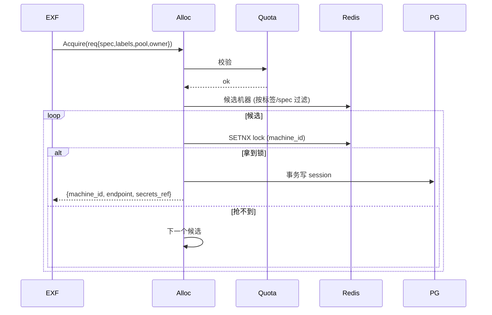
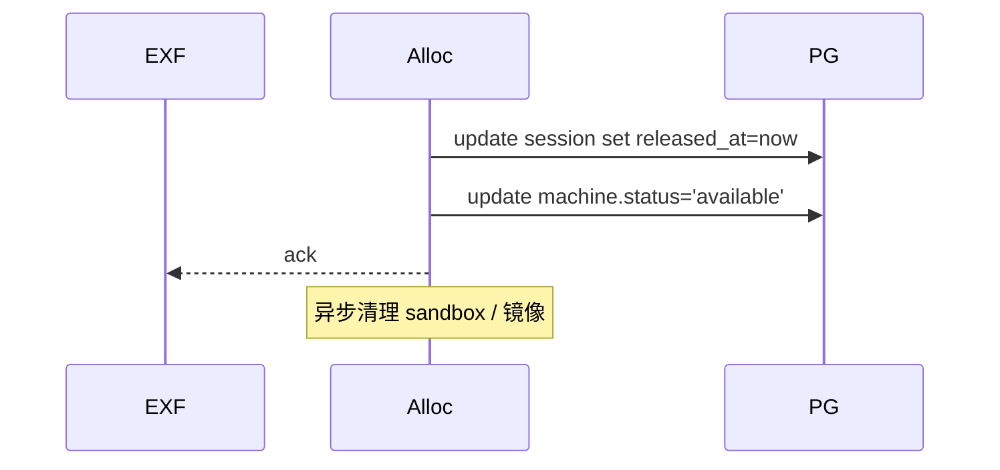
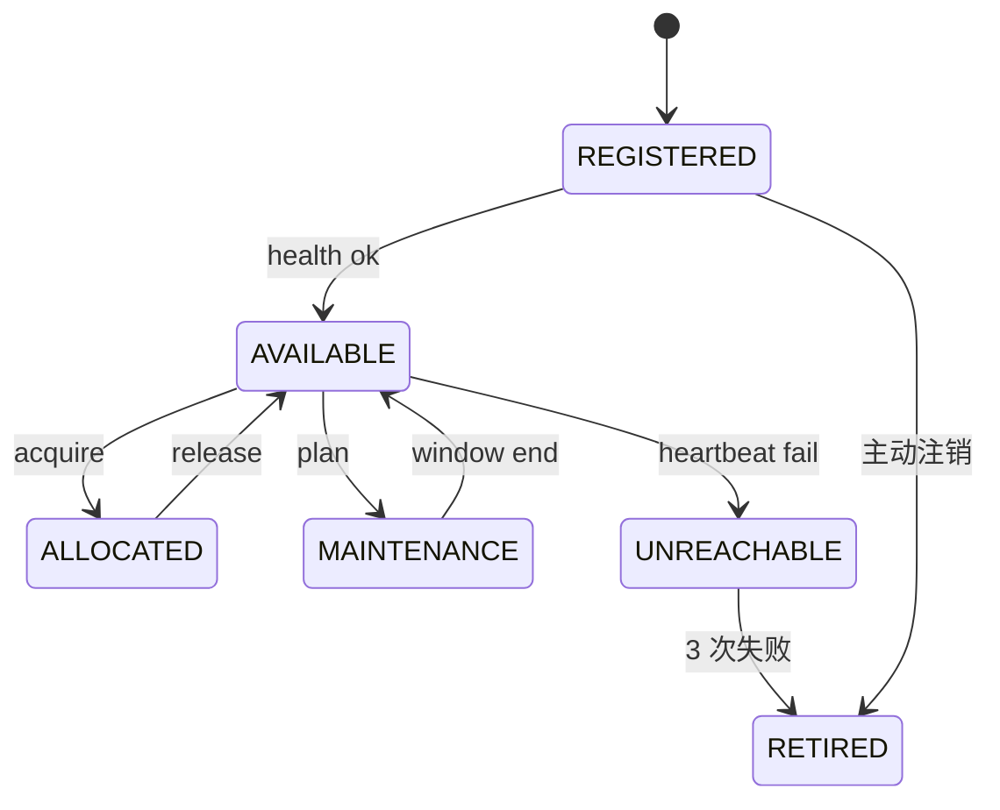
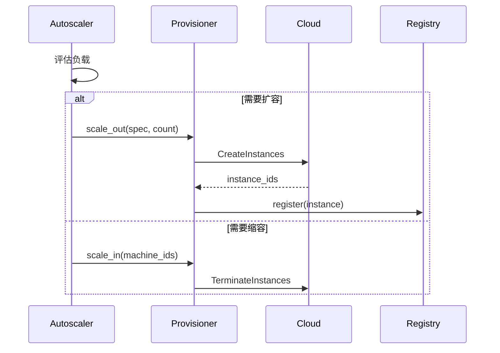
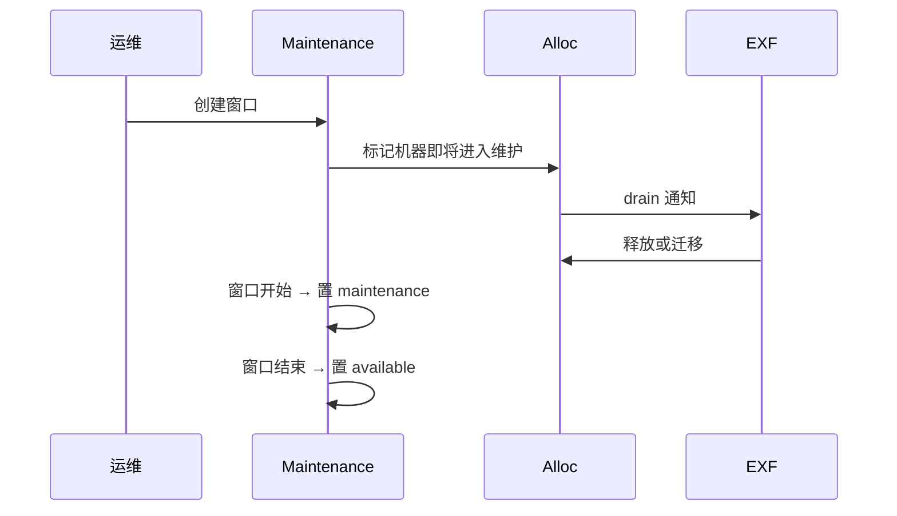

# 测试机器资源管理子系统设计文档（TMRM / Test Farm）

> 范围：管理**测试机器 / 设备 / 沙箱位**的全生命周期 —— 注册、调度、扩缩容、  
> 健康检查、配额、计费、维护。EXF 是其主要消费者。  
> 关联：[`architecture.md`](architecture.md) · [`requirements.md`](requirements.md) · [`execution-framework-design.md`](execution-framework-design.md) · [`test-report-management-design.md`](test-report-management-design.md)

---

## 1. 目标与非目标

### 1.1 目标
- 管理 ≥ 10K 机器 / 设备（含物理 / VM / 浏览器 / 移动端 / 嵌入式）。
- 分配 P95 ≤ 200 ms；释放同步，回收异步。
- 健康检查 30 s 一次；故障机器 60 s 内摘除。
- 多云（AWS / GCP / Azure）+ 私有 IDC。
- 配额、计费、维护计划。

### 1.2 非目标
- 不执行用例（EXF 负责）。
- 不存结果（TRM 负责）。
- 不调度任务（EXF 调度器消费 TMRM 的可用机器列表）。

## 2. 资源模型

```mermaid
erDiagram
  MACHINE ||--o{ SESSION : has
  MACHINE ||--o{ MAINTENANCE_WINDOW : has
  MACHINE ||--o{ HEALTH_RECORD : logs
  MACHINE ||--o{ MACHINE_LABEL : tagged
  POOL ||--o{ MACHINE : "contains"
  QUOTA ||--o{ POOL : "applies to"
  COST_RECORD }o--|| MACHINE : "incurred by"
  MACHINE {
    text id PK
    text name
    text type    -- host|browser|mobile|desktop|sandbox
    jsonb spec   -- cpu, mem, gpu, disk, network
    text status  -- available|allocated|maintenance|retired
    text provider
    text region
    text zone
    text image
    timestamptz last_heartbeat
  }
  SESSION {
    text id PK
    text machine_id FK
    text owner
    text plan_id
    text task_id
    timestamptz acquired_at
    timestamptz released_at
    text status
  }
  POOL { text id PK; text name; jsonb selectors }
  QUOTA { text team_id; text pool_id; int max_concurrent; int max_daily }
  MAINTENANCE_WINDOW { text machine_id; timestamptz start; timestamptz end; text reason }
  HEALTH_RECORD { text machine_id; timestamptz at; text status; int latency_ms; text error }
  MACHINE_LABEL { text machine_id; text key; text value }
  COST_RECORD { text machine_id; date day; numeric cost; text currency }
```

## 3. 总体架构

```mermaid
flowchart TB
  subgraph CP[控制面 TMRM (Go)]
    Reg[Registry<br/>机器注册/查询]
    Alloc[Allocator<br/>分配/释放]
    HC[Health Monitor<br/>心跳+探针]
    Quota[Quota Enforcer]
    Prov[Provisioner<br/>云/私有]
    Cost[Cost Aggregator]
    Maint[Maintenance Scheduler]
  end
  PG[(PostgreSQL<br/>元数据)]
  Redis[(Redis<br/>分配锁/缓存)]
  Bus[NATS]
  subgraph Cloud[云/IDC]
    AWS[AWS EC2]
    GCP[GCP]
    OnP[自有 IDC<br/>IPMI/Redfish]
  end
  subgraph Dev[设备]
    Mob[Android 设备农场]
    Br[Browser 集群]
  end
  EXF[EXF Worker] -. "请求/释放" .-> Alloc
  Worker[EXF Worker 进程] -->|heartbeat| HC
  Prov --> AWS
  Prov --> GCP
  Prov --> OnP
  Reg --> Mob
  Reg --> Br
```

## 4. 核心服务

| 服务 | 职责 | 候选实现 |
| --- | --- | --- |
| `tmrm-registry` | 注册 / 注销 / 标签 / 列表 | Go |
| `tmrm-allocator` | 分配 / 释放 / 抢占 | Go（含分配算法） |
| `tmrm-health` | 心跳 / 主动探针 / 摘除 | Go + eBPF |
| `tmrm-quota` | 配额校验 | Go |
| `tmrm-provisioner` | 弹性扩缩容（云） | Go（cloud SDK） |
| `tmrm-cost` | 计费采集 / Showback | Go |
| `tmrm-maint` | 维护窗口 | Go |
| `tmrm-port-mcp` | MCP Server | Go |

## 5. 分配算法

### 5.1 分配策略

| 策略 | 描述 |
| --- | --- |
| Best-fit | 选 spec 最接近请求的机器，减少浪费 |
| Spread | 同类型机器分散到不同 zone / host |
| Affinity | 复用上次机器（缓存命中） |
| Anti-affinity | 同 target 写用例分散 |
| FIFO | 同优先级先进先出 |

### 5.2 分配流程



**目标**：分配 P95 ≤ 200 ms。

### 5.3 释放



## 6. 健康检查

| 检查 | 频率 | 实现 |
| --- | --- | --- |
| 心跳 | 30 s | EXF Worker / 设备 agent |
| 主动探针 | 60 s | TMRM 拉起（synthetic case） |
| 资源 | 30 s | CPU / Mem / Disk / GPU |
| 网络 | 60 s | ping target / 浏览器可达性 |
| 业务探针 | 5 min | 浏览器打开测试页 / DB 连通 |

**摘除规则**：
- 3 次连续心跳失败 → 标记 `unreachable` → 摘除。
- 资源超阈值 > 2 min → 标记 `overload` → 不再分配。
- 主动探针失败 → `probe_failed` → 告警。



## 7. 扩缩容

### 7.1 触发器

| 类型 | 信号 | 动作 |
| --- | --- | --- |
| Reactive | 队列长度 > 阈值 / 利用率 > 80% | +N |
| Scheduled | 时间表（高峰前） | +N |
| Predictive | 历史负载 | +N（提前 30 min） |
| Off-peak | 持续低负载 | -N |

### 7.2 流程



## 8. 配额

```yaml
# 示例
quotas:
  - team: team-a
    pool: browser-pool
    max_concurrent: 20
    max_daily: 200
  - team: team-a
    pool: mobile-pool
    max_concurrent: 5
    max_daily: 50
```

- 校验时机：分配时（同步）+ 计费时（异步核对）。
- 超额：阻塞 + 告警。
- 突发：可申请 BurstToken（24h 临时配额）。

## 9. 计费

- 数据源：
  - 云：AWS Cost Explorer / GCP Billing API / Azure
  - 自有：按机器折旧 / 电力 / 机房
- 维度：machine × day × tag（team / project）。
- 展示：Showback（按团队）/ Chargeback（内部转账）。
- 异常：单价漂移 / 长时间 allocation → 告警。

## 10. 维护

- 计划维护：维护窗口（start/end + reason）。
- 维护期间：不分配，释放已分配。
- 通知：到期前 24h / 1h 通知 owner。
- 紧急维护：立即摘除 + 自动迁移任务。



## 11. API 设计（摘录）

```text
POST   /v1/machines                    # 注册
GET    /v1/machines?type=&labels=
DELETE /v1/machines/{id}
POST   /v1/allocate                    # 申请
POST   /v1/release/{session_id}
GET    /v1/pools
POST   /v1/pools
GET    /v1/quotas?team=
POST   /v1/quotas
POST   /v1/maintenance
GET    /v1/cost?team=&from=&to=
POST   /v1/autoscale/rules
GET    /v1/health
WS     /v1/stream                      # 状态变化
```

## 12. 安全

- API：OIDC + RBAC。
- 凭据：写时引用 + 运行期注入；机器 SSH 私钥托管在 Vault。
- 网络：TMRM 控制面与云 API 走 PrivateLink / 内网。
- 审计：所有变更留痕。

## 13. 性能

- 分配：P95 ≤ 200 ms（Redis 锁 + 候选 ≤ 100）。
- 注册：批量 1K / s。
- 健康：30 s 周期，单实例 5K 机器 / 30 s。
- 容量：PG 主从 + Redis Cluster。

## 14. AI 协作

- MCP 工具：`list_machines(labels)` / `acquire(spec)` / `release(id)` / `cost_report(team)`。
- 智能调度：LLM 根据历史负载建议预留计划。
- 故障预测：心跳 / 资源曲线 → 异常检测 → 提前摘除。

## 15. 演进路线

| 版本 | 能力 |
| --- | --- |
| v0.5 | 静态池 + 手动分配 |
| v0.8 | 配额 + 健康检查 |
| v1.0 | 多云 + 自动扩缩 + 计费 |
| v2.0 | 智能调度 + 预测性扩缩 |

