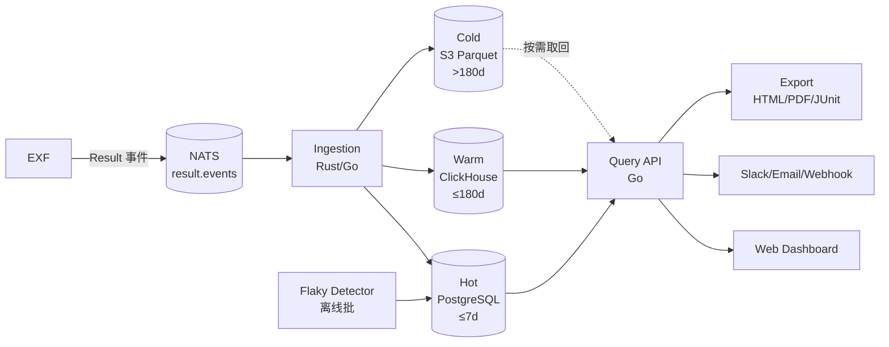
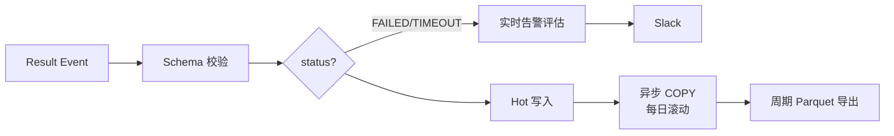
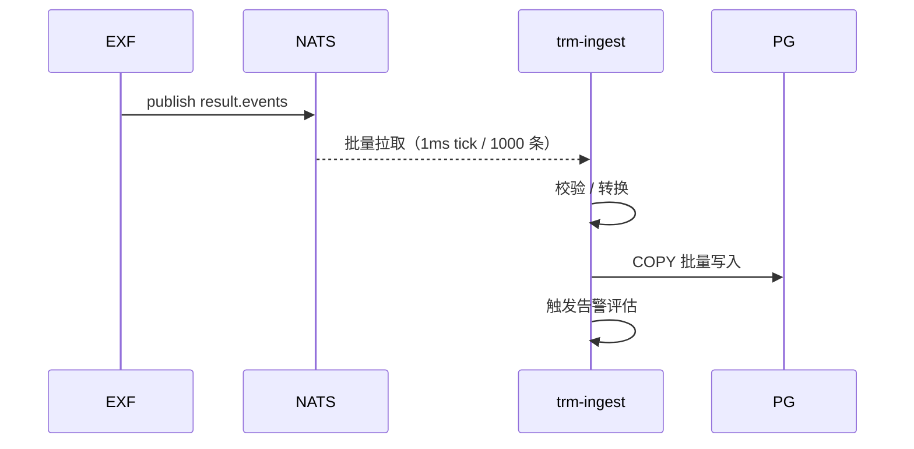
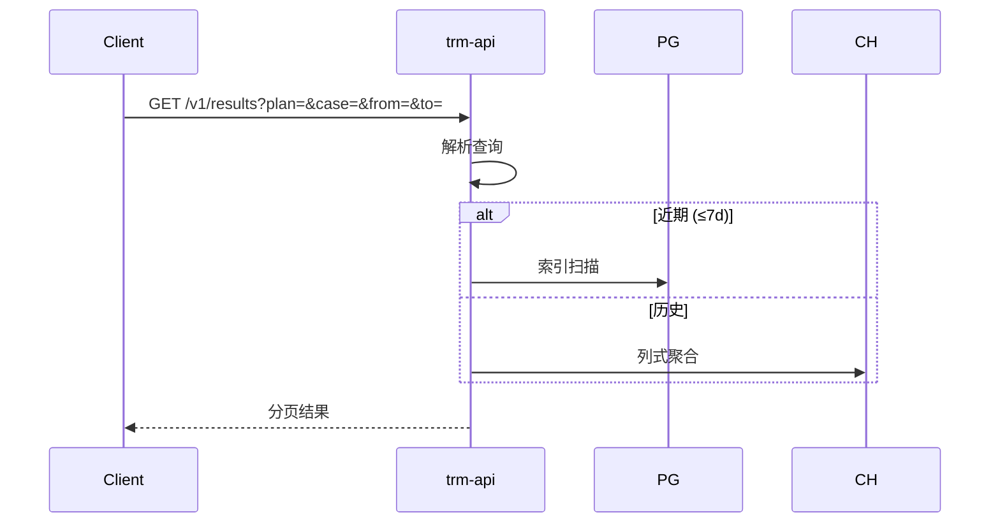
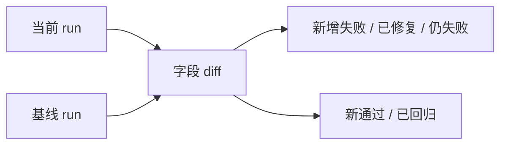
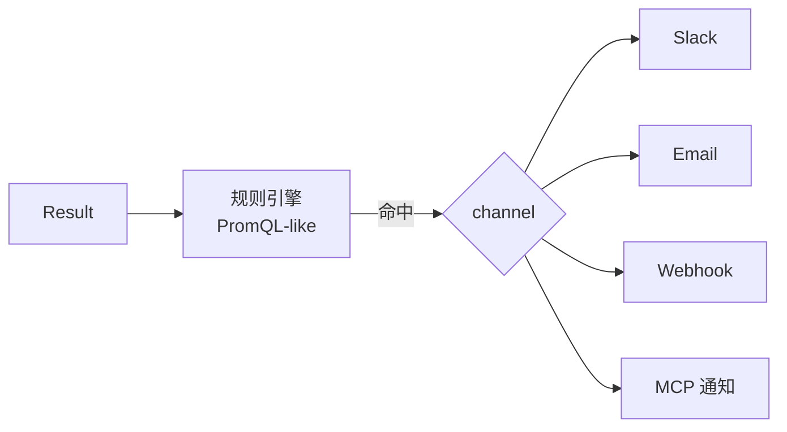

# 测试报告管理子系统设计文档（TRM）

> 范围：负责**执行结果**的接入、聚合、查询、可视化、对比、告警、Flaky 检测。  
> 关联：[`architecture.md`](architecture.md) · [`requirements.md`](requirements.md) · [`execution-framework-design.md`](execution-framework-design.md) · [`test-machine-resource-management-design.md`](test-machine-resource-management-design.md)

---

## 1. 目标与非目标

### 1.1 目标
- 实时接入 **10K+ events/s** 的执行结果事件。
- 查询 P95：摘要 ≤ 500 ms，下钻 ≤ 2 s。
- 保留 ≥ 12 个月，**冷热分层**。
- 自动识别 **flaky** / 慢用例 / 失败模式。
- 提供 **基线对比**（本次 vs 上一稳定版本）。
- 支持 **告警**（Slack / 邮件 / Webhook）与 **导出**（HTML / PDF / JUnit）。

### 1.2 非目标
- 不负责“执行”，由 EXF 完成。
- 不写用例元数据，与 TCM 解耦。
- 不直接管理资源，与 TMRM 解耦。

## 2. 用户旅程

| 角色 | 旅程 |
| --- | --- |
| 测试工程师 | 看 Plan 结果 / 失败回放 / 复跑 → 标记 flaky |
| 测试架构师 | 看趋势、对比版本、Flaky Top N、清理无效用例 |
| 平台 / SRE | 告警阈值、SLO Dashboard |
| AI / Agent | 拉失败摘要，生成修复 patch 建议 |

## 3. 总体架构



## 4. 数据模型

```mermaid
erDiagram
  RESULT_EVENT ||--o{ ARTIFACT : has
  RESULT_EVENT ||--o{ METRIC_SAMPLE : has
  RESULT_EVENT ||--|| CASE_SUMMARY : "rolls up to"
  PLAN_RUN ||--o{ RESULT_EVENT : contains
  PLAN_RUN ||--|| PLAN_SUMMARY : "rolls up to"
  ALERT_RULE ||--o{ ALERT_EVENT : fires
  RESULT_EVENT {
    text task_id PK
    text plan_id
    text case_id
    int  case_version
    text plugin
    text target_id
    text status
    timestamptz started_at
    timestamptz finished_at
    int duration_ms
    int attempt
    text error_code
    text error_message
    text trace_id
    jsonb labels
  }
  ARTIFACT { text kind; text uri; text sha256; int size }
  CASE_SUMMARY { text case_id; date day; int total; int passed; int failed; int flaky; int p50_ms; int p95_ms }
  PLAN_RUN { text plan_id PK; timestamptz started; timestamptz finished }
  PLAN_SUMMARY { text plan_id; int total; int passed; int failed }
  ALERT_RULE { text id PK; text expr; text channel }
  ALERT_EVENT { text id PK; text rule_id; timestamptz fired; jsonb payload }
```

## 5. 接入与存储分层

| 层 | 存储 | 保留 | 用途 | 索引 |
| --- | --- | --- | --- | --- |
| Hot | PostgreSQL | 7 天 | 实时查询 / 下钻 | `(case_id, started_at)`、`(plan_id)`、`(status)` |
| Warm | ClickHouse | 180 天 | 趋势 / 聚合 | 排序键 `(day, case_id)` |
| Cold | S3 Parquet | 12+ 月 | 合规 / 回放 | 分区 `day=YYYY-MM-DD` |

**数据流**：



## 6. 核心服务

| 服务 | 职责 | 候选实现 |
| --- | --- | --- |
| `trm-ingest` | 消费 NATS，写入 PG / ClickHouse | Rust（高吞吐） |
| `trm-api` | 查询、对比、导出 | Go |
| `trm-flaky` | 离线批，标记 flaky / 慢 / 漂移 | Go + SQL |
| `trm-alert` | 规则评估（PromQL-like） | Go |
| `trm-export` | 报告渲染（HTML / PDF） | Go + Chromium headless |
| `trm-port-mcp` | MCP Server（给 LLM 查） | Go / Python |

## 7. 关键流程

### 7.1 实时接入



### 7.2 查询



### 7.3 Flaky 检测

```mermaid
flowchart TB
  Data[最近 N 次结果] --> Win[滑动窗口 N=50]
  Win --> Stat{失败比例<br/>∈ [5%, 50%]?}
  Stat -- yes --> Mark[标记 flaky]
  Stat -- no --> Clean[正常]
  Mark --> Notify[写入 case.tags=flaky]
  Mark --> Hook[可选：自动转 TCM 提案]
```

**判定**：同一 case 在最近 50 次执行中，状态既有 PASS 又有 FAILED 且比例落在 `[5%, 50%]` → 标记 flaky。

### 7.4 基线对比



### 7.5 告警



## 8. API 设计（摘录）

```text
GET    /v1/results?plan=&case=&status=&from=&to=&cursor=
GET    /v1/results/{task_id}
GET    /v1/plans/{plan_id}/summary
GET    /v1/cases/{case_id}/history?days=30
GET    /v1/cases/flaky?days=7
POST   /v1/compare                # 基线对比
GET    /v1/trend?case=&metric=&from=&to=
GET    /v1/health                 # 通过率 / 延迟分位
POST   /v1/alerts/rules
POST   /v1/exports                # 异步生成 PDF/HTML
WS     /v1/stream                 # 实时
```

## 9. 性能设计

| 优化 | 落地 |
| --- | --- |
| 批量写入 | 1000 条/批，10 ms 窗口 |
| 异步落盘 | 失败重试 + 死信 |
| 冷热分层 | 查询自动路由 |
| 预聚合 | 每日生成 `case_summary` / `plan_summary` |
| 索引 | 按查询模式建复合索引 |
| 缓存 | Redis 5 min TTL 缓存热门 case 历史 |

**目标**：
- 接入：10K events/s，单实例 8 core 可承载。
- 查询：摘要 P95 < 500 ms；下钻 P95 < 2 s。
- Flaky 检测：日批 ≤ 10 min（1 亿用例规模下）。

## 10. 安全

- API：OIDC + RBAC（viewer/editor/admin）。
- 多租户：行级 `tenant_id` 过滤。
- 凭据：artifact URL 走预签名，时效 15 min。
- 审计：所有查询 / 导出留痕。

## 11. AI 协作

- **MCP 工具**：
  - `summarize_failure(plan_id)` → 自然语言摘要
  - `find_flaky(days)` → flaky 列表
  - `compare_runs(a, b)` → 差异
  - `explain_failure(task_id)` → 取 trace + 错误码，给修复建议
- **回写 TCM**：flaky 标记可自动写入 `case.tags`（需 RBAC）。

## 12. 演进路线

| 版本 | 能力 |
| --- | --- |
| v0.5 | PG 单库 + 简单查询 |
| v0.8 | ClickHouse 接入 + Flaky |
| v1.0 | 冷热分层 + 告警 + 导出 |
| v2.0 | MCP + AI 摘要 + 自愈触发 |

